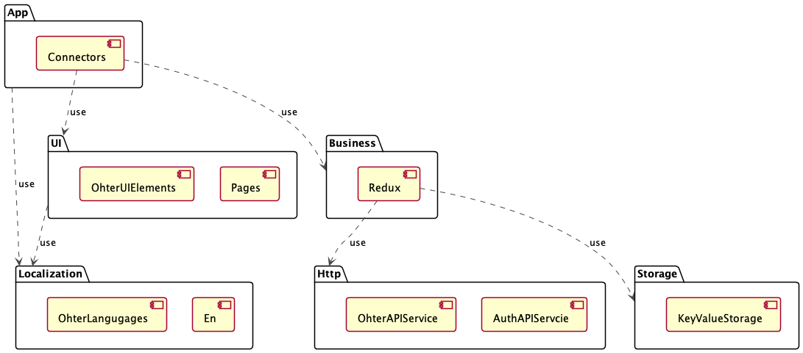

# Flutter Async Redux App templates

This repository is an assembled flutter application framework based on [AsyncRedux](https://pub.dev/packages/async_redux) state management. It is suitable for building medium and large applications.

It has four characteristics:

- Is easy to learn
- Is easy to use
- Is easy to test
- Has no boilerplate
- Multi packages App/UI/business/Localization/Http
- Code Generation (source_gen) for Http/Models/Localization
- Code generation templates (VSCode plugin)

## Modules UML

