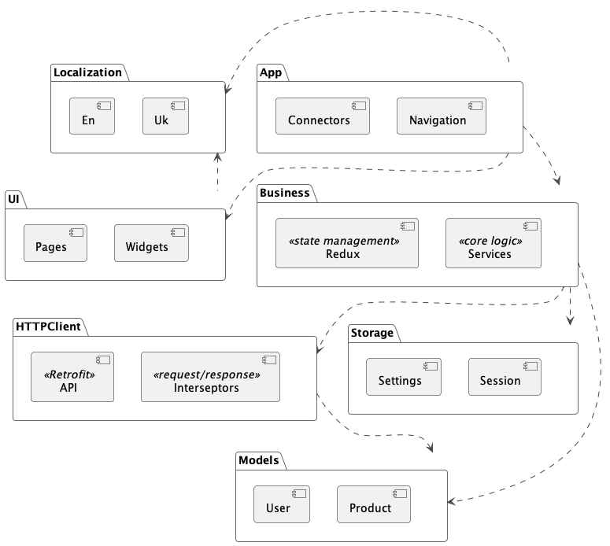

# Flutter Async Redux App Templates

This repository provides a structured Flutter application framework based on [AsyncRedux](https://asyncredux.com/flutter/intro) state management. It is designed for building medium to large-scale applications efficiently.

## Key Features

- **User-Friendly**: Easy to learn, use, and test.
- **Efficient Development**: Minimal boilerplate to streamline coding.
- **Modular Architecture**: Multi-package structure for clear separation of concerns:
  - **`App`**: Core application logic and navigation.
  - **`UI`**: User interface components and design.
  - **`Business`**: State management and core business logic.
  - **`Localization`**: Multi-language support.
  - **`Http`**: Network operations and API integration.
- **Automated Code Generation**:
  - Supports `source_gen` for Http clients, Models, and Localization.
  - Includes ready-to-use templates compatible with VSCode plugins.

## Project Structure

The project is organized into the following folders to ensure a clean separation of concerns and modular development:

- **`templates`**: Contains code generation templates for creating states, pages, and connectors. Supports VSCode integration for quick scaffolding.
- **`app`**: Handles app-wide configurations such as navigation, connectors, and entry points.
- **`ui`**: Manages the user interface, including pages, widgets, and design-related components.
- **`storybook`**: Provides a visual testing environment for UI components, ensuring they work as expected in isolation.
- **`business`**: Contains the core business logic, including Redux actions, reducers, and state management.
- **`http_client`**: Encapsulates HTTP-related logic, including API clients and network configurations.
- **`models`**: Defines reusable data models shared across the application.
- **`storage`**: Manages local storage solutions, such as caching and persistence layers.
- **`localization`**: Handles multi-language support, translations, and locale-specific logic.
- **`scripts`**: Includes utility scripts for automation, build configurations, and maintenance tasks.
- **`docs`**: Provides project documentation, guidelines, and resources for developers.

## Modules UML



## How to Use

Check VSCODE plugin [here](https://marketplace.visualstudio.com/items?itemName=yuanhjty.code-template-tool) install it and follow the instructions.

### Creating State

To create a new state:

1. Navigate to the `business/lib/redux` directory.
2. Open the context menu and select **"New File / Folder from Template."**
3. From the dropdown list, choose the template named **"State."**
4. A configuration window will appear to set the name of the new state. For example, enter `MyProfile`.

Once completed, a new folder named `my_profile` will be created in the `business/lib/redux` directory with the following structure:

- `models`: Contains data models used for storing and managing structured data. Refer to the [documentation](https://asyncredux.com/flutter/basics/state) for more details.
- `actions`: Defines business logic for updating state and interacting with external systems. Refer to the [documentation](https://asyncredux.com/flutter/basics/actions-and-reducers) for more details.
- `my_profile_selectors.dart`: Contains selectors for efficiently accessing specific parts of the state. Refer to the [documentation](https://asyncredux.com/flutter/miscellaneous/selectors) for more details.

#### Connecting the State to AppState

After creating the state files and folders, connect `MyProfileState` to `AppState` by editing the `business/lib/redux/app_state.dart` file. Below is an example of the changes:

```dart
import 'package:async_redux/async_redux.dart';
import 'package:freezed_annotation/freezed_annotation.dart';

import 'connectivity/models/connectivity_state.dart';
import 'forgot_password/models/forgot_password_state.dart';
import 'log_in/models/log_in_state.dart';
import 'my_profile/models/my_profile_state.dart';
import 'registration/models/registration_state.dart';
import 'reset_password/models/reset_password_state.dart';
import 'session/models/session_state.dart';

part 'app_state.freezed.dart';

@freezed
abstractclass AppState with _$AppState {
  const factory AppState({
    required ConnectivityState connectivity,
    required LogInState logIn,
    required RegistrationState registration,
    required ForgotPasswordState forgotPassword,
    required ResetPasswordState resetPassword,
    required SessionState session,
    required MyProfileState myProfile, // Add new state here
    required Wait wait,
  }) = _AppState;

  factory AppState.initial() => const AppState(
        connectivity: ConnectivityState(),
        logIn: LogInState(),
        registration: RegistrationState(),
        forgotPassword: ForgotPasswordState(),
        resetPassword: ResetPasswordState(),
        session: SessionState(), // Add new state here
        myProfile: MyProfileState(),
        wait: Wait.empty,
      );
}
```

Finally, run the following command to generate necessary code:

```bash
# business directory
dart run build_runner build --delete-conflicting-outputs
```

For more information on creating state, refer to the [AsyncRedux documentation](https://asyncredux.com/flutter/basics/state).

### Creating a New Page

To add a new page to the application:

1. Navigate to the `ui/lib/pages` directory.
2. Open the context menu and select **"New File / Folder from Template."**
3. From the dropdown list, choose the template named **"Page."**
4. A configuration window will appear. Enter the desired name for the new page, e.g., `MyProfile`.

Once completed, a new file named `my_profile_page.dart` will be created in the `ui/lib/pages` directory.

#### my_profile_page.dart

```dart
import 'package:flutter/material.dart';
import 'package:localization/localization.dart';

class MyProfilePage extends StatelessWidget {
  const MyProfilePage({
    super.key,
  });

  @override
  Widget build(BuildContext context) => Scaffold(
        appBar: AppBar(
          title: Text(S.current.title),
        ),
        body: const Stack(
          children: [
            Center(
              child: Text('MyProfilePage Coming soon...'),
            ),
          ],
        ),
      );
}
```

### Creating a Connector

A connector acts as a bridge between the state management layer and the UI layer. It links the application's state (managed by a `Store`) with the specific page or widget that needs to render or react to changes in that state.

#### Key Roles of a Connector

- **Decoupling UI and State Management:** Ensures a clean separation between business logic and UI, improving maintainability.
- **State Mapping:** Extracts and formats the necessary pieces of the global state (`AppState`) for the UI.
- **Action Dispatching:** Enables the UI to dispatch actions that can trigger updates in the global state.
- **Reactivity:** Listens for state changes and updates the UI accordingly.
- **Reusability:** Facilitates reuse across multiple widgets/pages for modular design.

#### How It Works

- **State Selection:** The connector retrieves only the relevant parts of the state for a specific widget/page, minimizing unnecessary rebuilds.
- **ViewModel Creation:** Formats the selected state into a `ViewModel` containing the required data and actions for the UI.
- **UI Binding:** Passes the `ViewModel` to the associated widget (e.g., `MyProfilePage`) through its constructor.

### Adding a Page Connector

To create a connector for a page:

1. Navigate to the `app/lib/connectors` directory.
2. Open the context menu and select **"New File / Folder from Template."**
3. From the dropdown list, choose the template named **"PageConnector."**
4. A configuration window will appear. Enter the desired name for the page connector, e.g., `MyProfile`.

Once completed, a new file named `my_profile_page_connector.dart` will be created in the `app/lib/connectors` directory.

#### my_profile_page_connector.dart

```dart
import 'package:async_redux/async_redux.dart';
import 'package:business/redux/app_state.dart';
import 'package:equatable/equatable.dart';
import 'package:flutter/material.dart';
import 'package:ui/pages/my_profile_page.dart';

class MyProfilePageConnector extends StatelessWidget {
  const MyProfilePageConnector({
    super.key,
  });

  @override
  Widget build(BuildContext context) => StoreConnector<AppState, _Vm>(
        debug: this,
        vm: () => _Factory(this),
        builder: (context, vm) => const MyProfilePage(),
      );
}

/// Factory that creates a view-model for the StoreConnector.
class _Factory extends VmFactory<AppState, MyProfilePageConnector, _Vm> {
  _Factory(super._connector);

  @override
  _Vm fromStore() => _Vm();
}

/// The view-model holds the part of the Store state the dumb-widget needs.
class _Vm extends Vm with EquatableMixin {
  _Vm();

  @override
  List<Object?> get props => [];
}
```

For more information on creating a connector, refer to the [AsyncRedux documentation](https://asyncredux.com/flutter/category/connector).

### Connecting State to a Page

Once you have created the state, the page, and the connector, the final step is to wire everything together. This ensures that your page can access and update the state managed by AsyncRedux.

#### Steps to Connect State to a Page

1. **Update the Page Connector**
   Update the `my_profile_page_connector.dart` file to retrieve and pass the necessary data from the state to the page. Below is an example:

   ```dart
   import 'package:async_redux/async_redux.dart';
   import 'package:business/redux/app_state.dart';
   import 'package:business/redux/my_profile/actions/set_value_action.dart';
   import 'package:business/redux/my_profile/my_profile_selectors.dart';
   import 'package:equatable/equatable.dart';
   import 'package:flutter/material.dart';
   import 'package:ui/pages/my_profile_page.dart';

   class MyProfilePageConnector extends StatelessWidget {
   const MyProfilePageConnector({
     super.key,
   });

   @override
   Widget build(BuildContext context) => StoreConnector<AppState, _Vm>(
         debug: this,
         vm: () => _Factory(this),
         builder: (context, vm) => MyProfilePage(
          // Pass the data to the page
           value: vm.value,
           onChangeValue: vm.onChangeValue,
         ),
       );
   }

   /// Factory that creates a view-model for the StoreConnector.
   class _Factory extends VmFactory<AppState, MyProfilePageConnector, _Vm> {
   _Factory(super._connector);

   @override
   _Vm fromStore() {
    // Select the data from the state
     final value = selectMyProfileValue(state);

     return _Vm(
       value: value,
       // Dispatch the action to update the state
       onChangeValue: (newValue) =>
           dispatchSync(SetValueAction(value: newValue)),
     );
   }
   }

   /// The view-model holds the part of the Store state the dumb-widget needs.
   class _Vm extends Vm with EquatableMixin {
   _Vm({
     required this.value,
     required this.onChangeValue,
   });

   final String? value;
   final ValueChanged<String> onChangeValue;

   @override
   List<Object?> get props => [
        // Add the properties to the props list
         value,
       ];
   }

   ```

2. **Update the Page Widget**
   Update the `my_profile_page.dart` file to accept the data passed through the connector and display it in the UI:

   ```dart
   import 'package:flutter/material.dart';
   import 'package:localization/localization.dart';

   class MyProfilePage extends StatelessWidget {
   const MyProfilePage({
     required this.value,
     required this.onChangeValue,
     super.key,
   });

   final String? value;
   final ValueChanged<String> onChangeValue;

   @override
   Widget build(BuildContext context) => Scaffold(
         appBar: AppBar(
           title: Text(S.current.title),
         ),
         body: Stack(
           children: [
             Center(
               child: Column(
                 children: [
                  // Display the value and provide a text field to update it
                   Text('Value: $value'),
                   TextField(
                     onChanged: onChangeValue,
                   ),
                 ],
               ),
             ),
           ],
         ),
       );
   }
   ```

3. **Add the Page to Navigation**
   Ensure that the `MyProfilePageConnector` is registered in the navigation system of your app. Update the `app/lib/navigation/routes.dart` _homeRouter_ to include the new page:

   ```dart
   GoRouter get _homeRouter => GoRouter(
     initialLocation: '/home',
     routes: [
       GoRoute(
         path: '/home',
         pageBuilder: (context, state) => MaterialPage<void>(
           key: state.pageKey,
           child:
               const ExceptionDialog<AppState>(child: HomePageConnector()),
         ),
         routes: [
          // Add the new page route here
           GoRoute(
             name: Routes.myProfile,
             path: 'my-profile',
             pageBuilder: (context, state) => MaterialPage<void>(
               key: state.pageKey,
               child: const MyProfilePageConnector(),
             ),
           ),
         ],
       ),
     ],
   );
   ```
