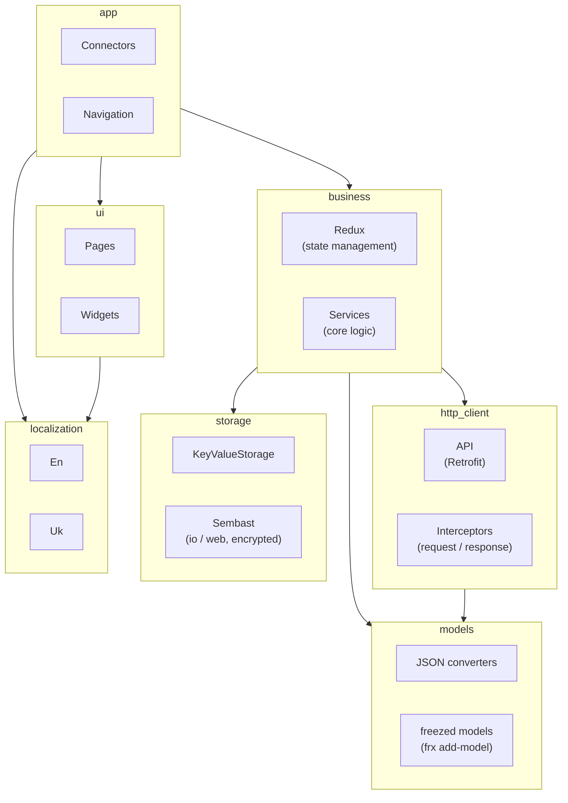
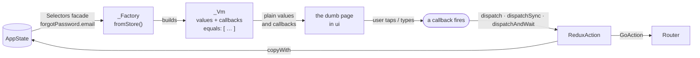

# Flutter Async Redux App Templates

This repository provides a structured Flutter application framework based on [AsyncRedux](https://asyncredux.com/flutter/intro) state management. It is designed for building medium to large-scale applications efficiently.

## Start a project from it

```bash
dart install --source path tools          # once: puts `frx` on your PATH
frx create my_app --org com.acme --title 'My App'
```

You get this monorepo under your own name, with every platform identifier already
yours — Android `applicationId` and `namespace`, the Apple bundle identifiers, the
Kotlin package **and its directory**, the app's title on the device and in its own
AppBar. `--dry-run` shows what it would write first.

Cloning works too, but leaves you to rename all of that by hand, and this
repository's own machinery — the CLI, its CI — comes with it. `frx create`
brings the product and leaves the machinery behind. See
[the CLI README](tools/README.md#start-a-project--frx-create).

## Key Features

- **User-Friendly**: Easy to learn, use, and test.
- **Efficient Development**: Minimal boilerplate to streamline coding.
- **Modular Architecture**: Multi-package structure for clear separation of concerns:
  - **`app`**: Core application logic and navigation.
  - **`ui`**: User interface components and design.
  - **`business`**: State management and core business logic.
  - **`http_client`**: Network operations and API integration.
  - **`models`**: Shared data models and JSON converters.
  - **`storage`**: Local persistence.
  - **`localization`**: Multi-language support.
- **Automated Code Generation**:
  - `build_runner` for states and models (freezed + json_serializable), HTTP
    clients (retrofit), routes (auto_route), theme extensions and assets.
  - `intl_utils` for localization — it runs on its own, not through
    `build_runner`.
  - The `frx` CLI generates *and wires* every artifact — it is the only
    scaffolding path; there are no editor snippet templates to keep in step.

## Project Structure

The project is organized into the following folders to ensure a clean separation of concerns and modular development:

- **`app`**: Handles app-wide configurations such as navigation, connectors, and entry points.
- **`ui`**: Manages the user interface, including pages, widgets, and design-related components.
- **`business`**: Contains the core business logic, including Redux actions, reducers, and state management.
- **`http_client`**: Encapsulates HTTP-related logic, including API clients and network configurations.
- **`models`**: Defines reusable data models shared across the application.
- **`storage`**: Manages local storage solutions, such as caching and persistence layers.
- **`localization`**: Handles multi-language support, translations, and locale-specific logic.
- **`tools`**: The `frx` dev CLI (scaffolds + AST-wires every artifact) and the FRX VSCode extension.
- **`docs/flows`**: Generated — every screen's use cases and the navigation map, read out of the source by `frx flow --md`. See [docs/flows/README.md](docs/flows/README.md).

## Modules


```mermaid
flowchart TD
    subgraph app["app"]
        Connectors
        Navigation
    end

    subgraph ui["ui"]
        Pages
        Widgets
    end

    subgraph business["business"]
        Redux["Redux<br>(state management)"]
        Services["Services<br>(core logic)"]
    end

    subgraph http_client["http_client"]
        API["API<br>(Retrofit)"]
        Interceptors["Interceptors<br>(request / response)"]
    end

    subgraph storage["storage"]
        KeyValue["KeyValueStorage"]
        Sembast["Sembast<br>(io / web, encrypted)"]
    end

    subgraph models["models"]
        Converters["JSON converters"]
        Shared["freezed models<br>(frx add-model)"]
    end

    subgraph localization["localization"]
        En
        Uk
    end

    app --> ui
    app --> business
    app --> localization
    ui --> localization
    business --> http_client
    business --> storage
    business --> models
    http_client --> models
```

Dependencies flow one way, top to bottom: `app` composes the whole thing,
`business` owns state and reaches out to `http_client` / `storage`, and
`models` / `localization` are leaves that depend on nothing. The arrows mirror
the `dependencies:` blocks in each package's `pubspec.yaml` — nothing points
back up.

## How to Use

### Scaffolding with `frx`

The repo ships its own dev CLI — **`frx`** (in [`tools/`](tools/)) — that
generates every artifact of this architecture *and* wires it in by editing the
source AST (AppState field + `initial()` entry, `AutoRoute` registration, the
selectors facade), so nothing is connected by hand:

```bash
cd tools && make install PROFILE=Flutter   # `frx` on PATH + the VSIX in that profile
```

Or without the Makefile:

```bash
cd tools && dart pub get
dart run bin/frx.dart <command>     # or `dart install .` to get `frx` on PATH
```

| Command | What it scaffolds / does |
| --- | --- |
| `new` | **Interactive wizard** — pick an artifact, answer prompts; echoes the equivalent command |
| `add-substate` | AsyncRedux substate (value / search / table) + AppState & selectors wiring |
| `add-page` | Page + `@RoutePage()` connector + `AutoRoute` in `AppRouter` (`--public`, `--param`, `--path`) |
| `add-tabs` | `AutoTabsScaffold` shell + tab pages + nested route |
| `add-action` | `ReduxAction` into a substate (sync / async / waiting, `--mixin` debounce / throttle / retry / …) |
| `add-field` | Add a field to an existing substate's `@freezed` state (`--default`, `--action` scaffolds its setter, and a `Select` getter unless `--no-selector`) |
| `add-selector` | Add a computed getter to a substate's `Select<Pascal>` facade (`--type`, `--expr`) |
| `add-widget` | Widget + its previews in `ui` — `-k field\|choice\|action\|view\|container` picks what it takes in and which primitive it wraps; `--dir` names the folder (required) |
| `add-connector` | A `StoreConnector` in `app` for a dumb widget |
| `add-nav` | Wire a navigation hop between two pages — the `_Vm` callback, the `GoAction` dispatch, the page parameter, typed route args |
| `add-model` / `add-retrofit` | freezed model (`--case` ×N → sealed union) / Retrofit client |
| `add-enum` | Plain enum in `models` (`-v` per value) |
| `add-service` | Service + Redux dispatcher pair |
| `add-theme-extension` | `ThemeExtension` in `ui` |
| `batch` | Wire a declared list of artifacts (JSON file or stdin) in **one transaction** |
| `remove` | Delete a substate/page **and unwire it** (previews first; `--apply` applies) |
| `rename` | Rename a substate/page — files, classes, **every wiring reference** (previews first) |
| `list-substates` / `list-routes` | Inventory, human table or `--json` |
| `list-widget-dirs` | The `ui/lib` folders that hold widgets — what `add-widget --dir` suggests |
| `list-mixins` | The action mixins, what each implies and what it excludes |
| `which` | Resolve an identifier (class/route/field) to its artifact (powers the editor's F2 rename) |
| `flow` | Diagram a page's use cases (`<page>`), the whole app's navigation (`--routes`), or export both to `docs/flows/` (`--md`) |
| `graph` | The whole app as one graph — substates, actions, pages, selectors, services and the edges between them, plus what frx **could not** resolve (`--json`, `--focus <id>`) |
| `watch` | Run `build_runner watch` from anywhere (whole workspace, or one `--package`) |
| `completions` | Print a shell completion script for bash / zsh / fish — `source <(frx completions zsh)` (completes commands, flags & live substate/route names) |
| `doctor` | Audit wiring, codegen & placement drift; `--fix` auto-repairs what it can |

Every generator supports `--dry-run`, `--force`, and `--format`; the ones whose
output needs codegen (substate, page, tabs, model, retrofit, theme extension,
and `add-field`) also take `--build-runner`/`-b` to run it right after. The
commands that edit existing files (`rename`, `remove`, `add-field`,
`add-selector`, `add-nav`) take `--diff` to print a unified diff of the change
alongside the plan. Everything that writes accepts `--json` — `frx new`, a
dialogue, is the one exception — and emits the changeset in one format, marked
applied or not; see
[the CLI README](tools/README.md#machine-readable-output).

**Behaviour diagrams that can't rot.** `frx flow` reads the connectors' AST and
draws what actually happens — a page's use cases as a sequence diagram, or the
whole app's screens and the hops between them
([docs/flows/](docs/flows/README.md), regenerated with `frx flow --md`). Because
the export is a pure function of the sources, `frx doctor` — and so CI — fails
the moment a connector changes without the docs being regenerated.

**Project defaults (`.frxrc`).** Drop a `.frxrc` JSON at the repo root to set the
house style once — `{"buildRunner": true, "format": true, "substateKind": "table"}`.
Each value is applied only when the command accepts that flag and you didn't pass
it; an explicit CLI flag always wins. A `"placement"` block is the exception —
not a flag, but a [per-rule opt-out](tools/README.md#placement-findings) for the
audit's placement warnings.

### VS Code extension

[`tools/vscode/`](tools/vscode/) wraps the CLI in an editor UI: every capability
by name in the Command Palette plus a status-bar **frx** action overlay, a
`build_runner watch` toggle that survives reloads, an **FRX** tree view
(substates expanding into their actions and selectors, routes with their path and
access, click-to-open throughout), **F2** on a symbol renaming the whole artifact,
a **Flow** sequence diagram and **Navigation map** in the markdown preview, a
**Map** webview of the whole wiring graph, and `frx doctor` findings mirrored into
the Problems panel. See its [README](tools/vscode/README.md) for the details and
how to build the VSIX.

### Code generation & build workflow

Several packages use `build_runner` — freezed and json_serializable (`models`,
`http_client`, `business`), retrofit (`http_client`), auto_route (`app`),
theme_extensions and flutter_gen (`ui`). The workspace shares one resolution, so
codegen runs per package.

`localization` is the exception: its `S` class comes from `intl_utils`, driven by
the `flutter_intl:` block in its `pubspec.yaml` (the Flutter Intl editor plugin,
or `dart run intl_utils:generate`). `build_runner` never touches it, so editing
an `.arb` does not regenerate on save.

**Use `watch`, not repeated `clean` builds.** On this repo a *clean* build takes
~24s — but ~18s of that is a one-time AOT compile of the builder script, cached
in `.dart_tool/build`. An incremental build reuses that snapshot and finishes in
~2s.

```bash
# Recommended: leave it running; edits regenerate in ~2s.
dart run build_runner watch --workspace

# One-off incremental build (also fast — reuses the cache):
dart run build_runner build --workspace
```

Only run `clean` when the cache is actually stale or after bumping a generator
version — it forces the ~18s builder recompile:

```bash
dart run build_runner clean --workspace
```

When you only touched one package, build just that package (smaller builder
graph to compile) instead of `--workspace`:

```bash
cd business && dart run build_runner build   # edited a freezed model
cd app && dart run build_runner build        # added a route
```

### Widget previews

```bash
cd ui && flutter widget-preview start
```

**Run it from `ui`, not from `app`.** The previewer scans only the package it is
started in — it does not follow workspace dependencies. Started in `app` it
finds zero previews in `ui` and shows an empty list, with no error to explain
why.

Previews use `@AppPreview` from [`ui/lib/theme/preview.dart`](ui/lib/theme/preview.dart),
not `@Preview` directly:

```dart
@AppPreview(group: 'Button', name: 'Primary', size: Size(260, 80))
Widget previewPrimary() =>
    Button.primary(label: 'Click Me', onPressed: () {});
```

It is `@Preview` with this app's themes already attached. Widgets here read
theme-varying tokens through `context.colors`, a `ThemeExtension` — under a
bare `ThemeData` it resolves to null and takes the widget down. Carrying the
theme on the annotation makes a preview without it impossible to write,
instead of something each author has to remember.

Note that `theme:` on `@Preview` is a `PreviewThemeData Function()`, not a
`PreviewThemeData`. Passing the value is a compile error twice over — wrong
type, and a method call inside a constant expression — which is the other half
of why the custom annotation exists.

**Previews live in `ui/lib/previews/`, mirroring the package**: the previews for
`ui/lib/buttons/button.dart` sit in `ui/lib/previews/buttons/button.dart`.
Nothing imports that tree, so it never reaches the app's compile graph — a
broken fixture fails `dart analyze` but not `flutter build`. Keeping them out of
the widget file also keeps production code from importing
`package:flutter/widget_previews.dart`.

The tree must stay under `lib/`. The previewer imports each file by its
`package:` URI, and a file outside `lib/` has none — `flutter widget-preview`
crashes on it rather than skipping it.

`frx add-widget` writes both files, so a scaffolded widget arrives with its
states already enumerated. `frx doctor` reports a preview whose widget moved or
was deleted — the one thing a tree nobody imports cannot notice on its own.

### Creating state

```bash
frx add-substate my_profile --kind value -b
```

One command creates the substate folder **and wires it in** — no hand-editing:

- `business/lib/redux/my_profile/models/my_profile_state.dart` — a `@freezed`
  state class (`--kind value | search | table` picks the flavour: a single
  value, a query + results view, or a byId table with waiting actions).
- `business/lib/redux/my_profile/actions/…` — starter `ReduxAction`s for the
  chosen flavour.
- **`AppState`** gets the import, the `required MyProfileState myProfile`
  factory field, and the `initial()` entry.
- **`selectors.dart`** gets a `SelectMyProfile` extension type wired into the
  `Select`/`Selectors` facade — actions and view-model factories mix in
  `Selectors` and read state through its bare getters (e.g.
  `myProfile.value`, as in the connector example below).

`-b` runs `build_runner` right after (or let the watch regenerate on save).
Add more actions later with `frx add-action my_action -s my_profile -k async`.

For the concepts behind state and actions see the
[AsyncRedux documentation](https://asyncredux.com/flutter/basics/state).

### Creating a page

```bash
frx add-page my_profile -b            # protected (default)
frx add-page intro --public           # reachable while logged out
frx add-page details -p id:int        # typed path param → /details/:id
frx add-tabs dashboard -t home -t profile   # AutoTabsScaffold + tab pages
```

`add-page` generates the dumb page (`ui/lib/pages/my_profile_page.dart`), the
`@RoutePage()` connector (`app/lib/connectors/my_profile_page_connector.dart`),
and inserts the `AutoRoute(page: MyProfileRoute.page, path: '/my-profile')`
entry into [`AppRouter`](app/lib/navigation/app_router.dart). `build_runner`
then generates the `MyProfileRoute` class. `--public` also registers the route
in the auth guard's `_authArea` set, so it stays reachable while logged out.

### The connector pattern

A connector bridges the state layer and the UI: it selects the relevant slice
of `AppState`, shapes it into a view-model, and hands the dumb page its data
and callbacks.


```mermaid
flowchart LR
    state[("AppState")]
    state -->|"Selectors facade<br>forgotPassword.email"| factory["_Factory<br>fromStore()"]
    factory -->|"builds"| vm["_Vm<br>values + callbacks<br>equals: [ … ]"]
    vm -->|"plain values<br>and callbacks"| page["the dumb page<br>in ui"]
    page -->|"user taps / types"| cb(["a callback fires"])
    cb -->|"dispatch · dispatchSync · dispatchAndWait"| action["ReduxAction"]
    action -->|"copyWith"| state
    action -->|"GoAction"| router["Router"]
```

- **Decoupling:** business logic never leaks into `ui` — pages receive plain
  values and callbacks. Nothing in the loop lets `ui` reach `AppState`.
- **State mapping:** the `_Factory` reads state through the `Selectors` facade.
- **Action dispatching:** callbacks dispatch actions (`dispatch`,
  `dispatchSync`, `dispatchAndWait`).
- **Reactivity:** the loop closes on `copyWith`, and the page rebuilds only when
  `Vm`'s `equals` list changes.

The current shape (see the live
[`forgot_password_page_connector.dart`](app/lib/connectors/forgot_password_page_connector.dart)):

```dart
@RoutePage()
class ForgotPasswordPageConnector extends StatelessWidget {
  const ForgotPasswordPageConnector({super.key});

  @override
  Widget build(BuildContext context) => StoreConnector<AppState, _Vm>(
    debug: this,
    vm: () => _Factory(this),
    builder: (context, vm) => ForgotPasswordPage(
      email: vm.email,
      onPressedResetPassword: vm.onPressedResetPassword,
      onPressedBackToLogin: vm.onPressedBackToLogin,
    ),
  );
}

class _Factory extends VmFactory<AppState, ForgotPasswordPageConnector, _Vm>
    with Selectors {
  _Factory(super._connector);

  @override
  _Vm fromStore() => _Vm(
    email: FieldVm(
      value: forgotPassword.email,               // read via the Selectors facade
      validator: (v) => emailValidator(v),
      onChanged: (v) => dispatchSync(SetEmailAction(v)),
    ),
    onPressedResetPassword: () => dispatch(ForgotPasswordAction()),
    onPressedBackToLogin: () => dispatch(GoAction.pop()),
  );
}

class _Vm extends Vm {
  _Vm({
    required this.email,
    required this.onPressedResetPassword,
    required this.onPressedBackToLogin,
  }) : super(equals: [email]);                   // rebuild only when this changes

  final FieldVm<String?> email;
  final VoidCallback onPressedResetPassword;
  final VoidCallback onPressedBackToLogin;
}
```

For standalone widgets (not pages) use `frx add-widget` + `frx add-connector`.

`add-widget` writes two files: the widget in `ui/lib/<dir>/`, and its previews
in `ui/lib/previews/<dir>/`. Nothing imports the previews tree, so it stays out
of the app's compile graph — and the widget file never imports preview
machinery. `--dir` is required: the folder says what the widget *is*, and the
old default left `ui/lib/widgets/` empty while every real widget was placed by
hand. Completion lists the folders already in use; a new name creates one.
More on connectors: [AsyncRedux documentation](https://asyncredux.com/flutter/category/connector).

### Navigation

Routing is [auto_route](https://pub.dev/packages/auto_route). Route classes
(`LogInRoute`, `HomeRoute`, …) are generated from the `@RoutePage()` connectors
into `app_router.gr.dart`; the auth gate is a global `_AuthGuard` re-evaluated
whenever the session token flips. Navigation from actions goes through
[`GoAction`](app/lib/navigation/go_action.dart):

```dart
dispatch(GoAction.push(const HomeRoute()));
dispatch(GoAction.replace(const LogInRoute()));
dispatch(GoAction.navigate(const HomeRoute()));
dispatch(GoAction.pop());
dispatch(GoAction.popUntilRoot());
```

Don't write a hop by hand — `frx add-nav` does it:

```bash
frx add-nav catalog item                 # CatalogPage gains onTapItem
frx add-nav splash home -k replace       # GoAction.replace, no back to it
```

It is five edits over two packages (the `_Vm` callback field, the dispatch that
fills it, the argument handed down in `builder:`, the parameter on the dumb page,
the two imports), and four of the five leave code that does not compile on their
own. The destination's parameters come along typed — read from its connector's
fields, so `/item/:id` yields `void Function(int) onTapItem` and
`ItemRoute(id: id)`.

### Keeping the project consistent

```bash
frx doctor          # audit: wiring drift, orphans, ungenerated code, stale
                    # docs/flows, misplaced declarations, the empty folder a
                    # removed substate leaves behind, previews left behind by a
                    # moved widget, a watch that outlived its IDE
frx doctor --fix    # auto-repair: run codegen, remove orphan substates and
                    # empty artifact folders, regenerate docs/flows
frx remove my_profile --apply   # delete any artifact and unwire it (kind auto-detected)
```

CI ([.github/workflows/ci.yml](.github/workflows/ci.yml)) runs the same gate on
every push, in three jobs: the workspace (formatting, analysis, generated-code
freshness, `frx doctor`, and frx's reality test against this repo), the `frx`
CLI (format, analyze, `dart test`), and the VS Code extension (typecheck,
manifest validation, tests, VSIX packaging).
