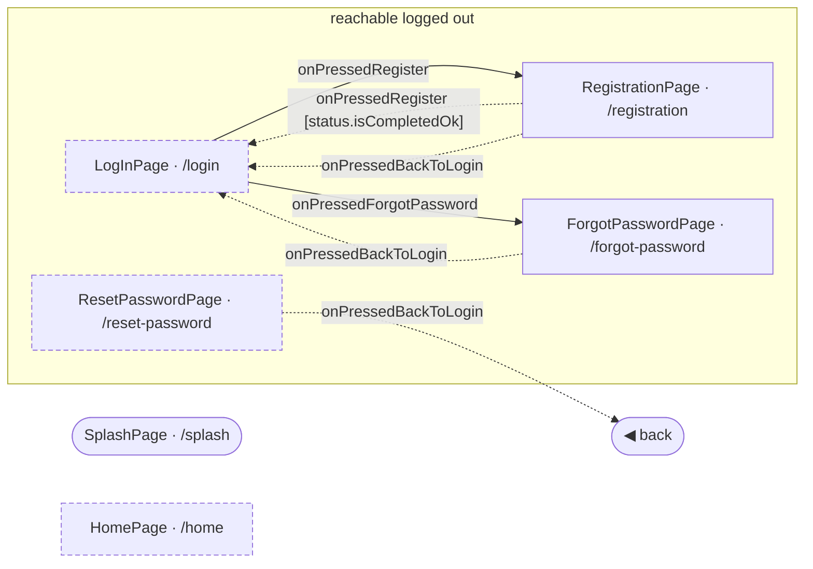

<!-- generated by `frx flow --md` — do not edit, re-run it -->

# App flows

Every screen the router registers, and every hop between them — read out of the connectors by `frx flow`.

Solid arrow: `push`. Dashed: `pop` (drawn back to the only screen that pushes it, when there is exactly one). Thick: a hop that replaces the stack. `⚡` marks navigation dispatched from a reducer rather than the view-model. A dashed border means nothing pushes that screen — you arrive by path, deep link or a guard redirect.

| Screen | Path | Logged out | Use cases | Flow |
| --- | --- | --- | --- | --- |
| `SplashPage` _(initial)_ | `/splash` | no | 0 | [splash](splash.md) |
| `LogInPage` | `/login` | yes | 6 | [logIn](logIn.md) |
| `RegistrationPage` | `/registration` | yes | 5 | [registration](registration.md) |
| `ForgotPasswordPage` | `/forgot-password` | yes | 3 | [forgotPassword](forgotPassword.md) |
| `ResetPasswordPage` | `/reset-password` | yes | 4 | [resetPassword](resetPassword.md) |
| `HomePage` | `/home` | no | 0 | [home](home.md) |
