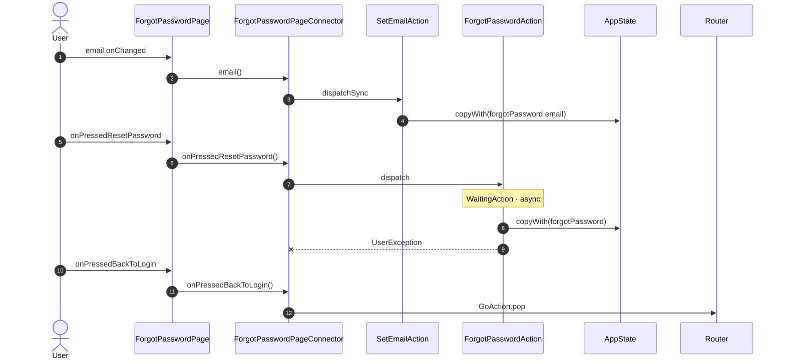

<!-- generated by `frx flow --md` — do not edit, re-run it -->

# ForgotPasswordPage

`app/lib/connectors/forgot_password_page_connector.dart`

| Interaction | Dispatches | Writes |
| --- | --- | --- |
| `email.onChanged` | `SetEmailAction` | `forgotPassword.email` |
| `onPressedResetPassword` | `ForgotPasswordAction` | `forgotPassword` |
| `onPressedBackToLogin` | `GoAction.pop` | — |

`?` marks a dispatch that only runs under a condition.

[← all flows](README.md)
