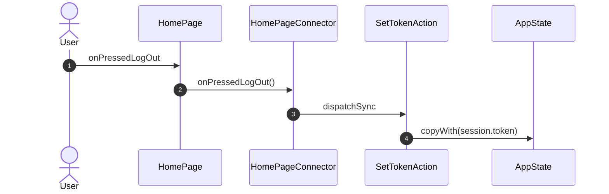

<!-- generated by `frx flow --md` — do not edit, re-run it -->

# HomePage

`app/lib/connectors/home_page_connector.dart`

| Interaction | Dispatches | Writes |
| --- | --- | --- |
| `onPressedLogOut` | `SetTokenAction` | `session.token` |

`?` marks a dispatch that only runs under a condition.

[← all flows](README.md)
