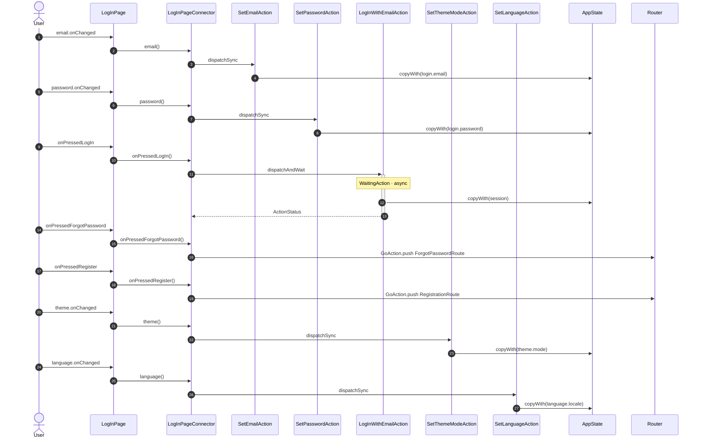

<!-- generated by `frx flow --md` — do not edit, re-run it -->

# LogInPage

`app/lib/connectors/log_in_page_connector.dart`

| Interaction | Dispatches | Writes |
| --- | --- | --- |
| `email.onChanged` | `SetEmailAction` | `login.email` |
| `password.onChanged` | `SetPasswordAction` | `login.password` |
| `onPressedLogIn` | `LogInWithEmailAction` | `session` |
| `onPressedForgotPassword` | `GoAction.push` | — |
| `onPressedRegister` | `GoAction.push` | — |
| `theme.onChanged` | `SetThemeModeAction` | `theme.mode` |
| `language.onChanged` | `SetLanguageAction` | `language.locale` |

`?` marks a dispatch that only runs under a condition.

[← all flows](README.md)
