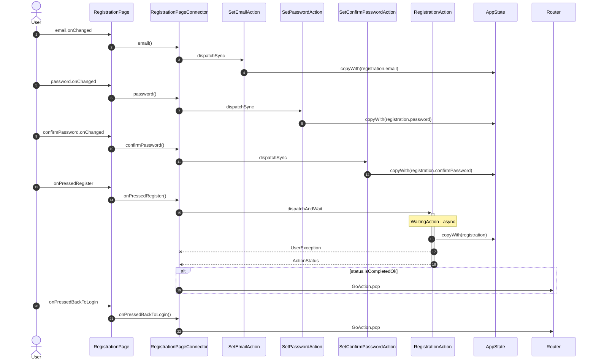

<!-- generated by `frx flow --md` — do not edit, re-run it -->

# RegistrationPage

`app/lib/connectors/registration_page_connector.dart`

| Interaction | Dispatches | Writes |
| --- | --- | --- |
| `email.onChanged` | `SetEmailAction` | `registration.email` |
| `password.onChanged` | `SetPasswordAction` | `registration.password` |
| `confirmPassword.onChanged` | `SetConfirmPasswordAction` | `registration.confirmPassword` |
| `onPressedRegister` | `RegistrationAction`, `GoAction.pop` ? | `registration` |
| `onPressedBackToLogin` | `GoAction.pop` | — |

`?` marks a dispatch that only runs under a condition.

[← all flows](README.md)
