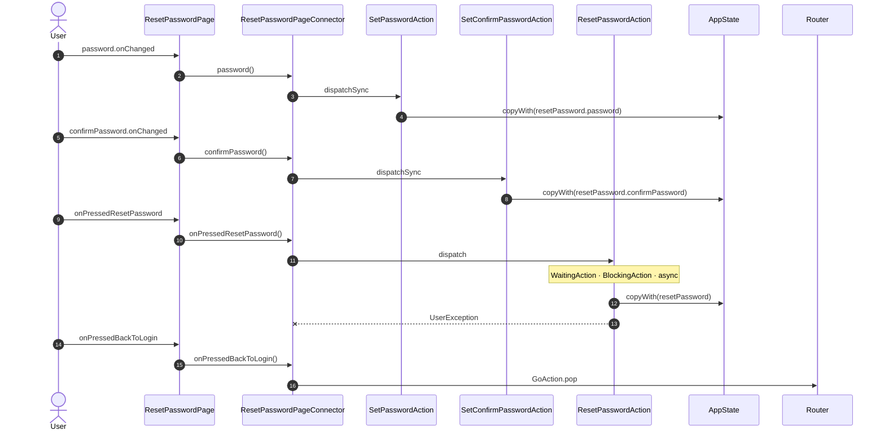

<!-- generated by `frx flow --md` — do not edit, re-run it -->

# ResetPasswordPage

`app/lib/connectors/reset_password_page_connector.dart`

| Interaction | Dispatches | Writes |
| --- | --- | --- |
| `password.onChanged` | `SetPasswordAction` | `resetPassword.password` |
| `confirmPassword.onChanged` | `SetConfirmPasswordAction` | `resetPassword.confirmPassword` |
| `onPressedResetPassword` | `ResetPasswordAction` | `resetPassword` |
| `onPressedBackToLogin` | `GoAction.pop` | — |

`?` marks a dispatch that only runs under a condition.

[← all flows](README.md)
