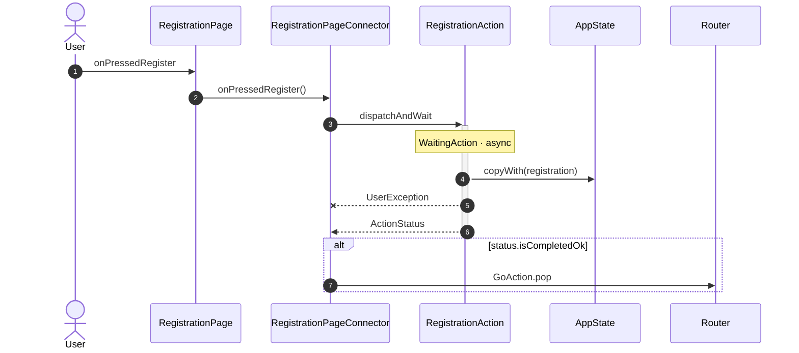
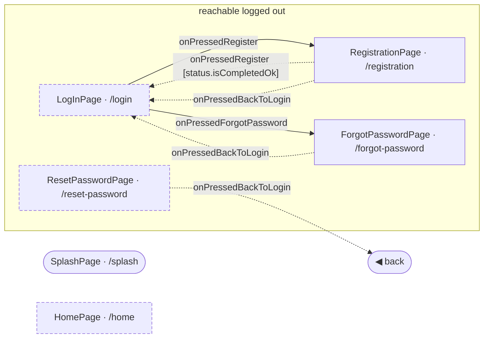
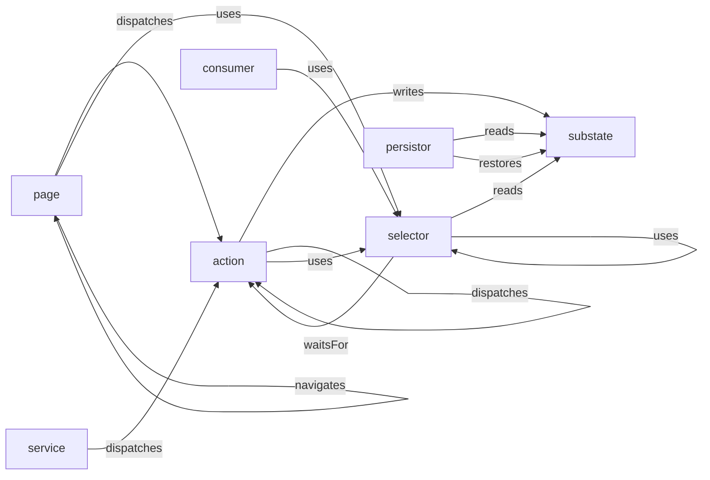
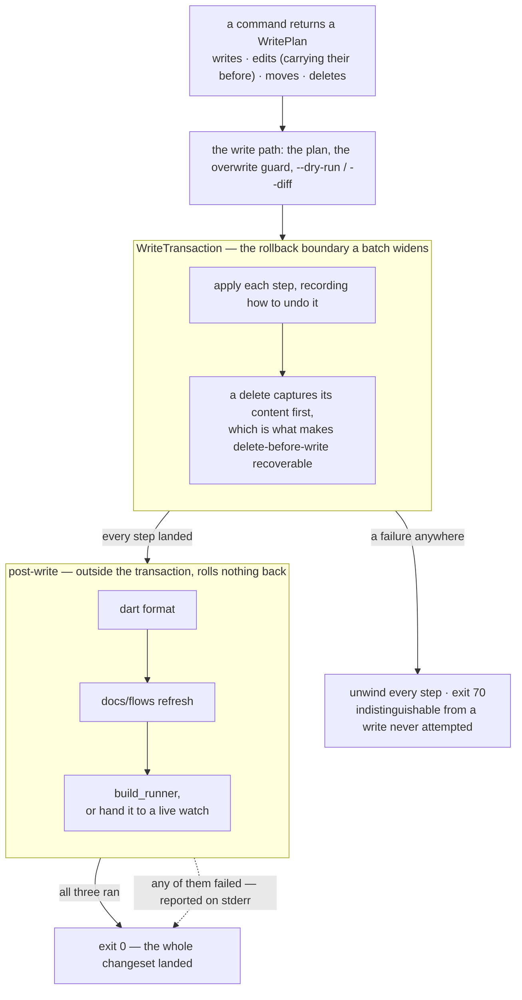

# frx — the dev CLI for this Flutter Redux monorepo

`frx` scaffolds every artifact of this architecture **and wires it in** by
editing the source AST — the `AppState` field + `initial()` entry, the
`selectors.dart` facade, the `AutoRoute` registration and the auth guard — so
nothing is connected by hand. It also renames, removes, audits, and completes.

Parsing (not resolving) the analyzer AST is enough to read and locate nodes, so
`frx` is fast and needs no package resolution at runtime. Edits are computed as
precise character-offset splices and normalized with `dart format`.

- **Companion VS Code extension:** [`vscode/`](vscode/) wraps every command in
  editor UI (F2 rename, tree view, doctor → Problems, watch toggle, a wiring
  map). See its [README](vscode/README.md).

---

## Install & run

**To just use frx, install the binary — you do not need this checkout, or a Dart
SDK:**

```bash
# macOS · Linux
curl -fsSL https://raw.githubusercontent.com/pro100andrey/flutter_redux_templates/main/tools/scripts/install.sh | sh
```

```powershell
# Windows
irm https://raw.githubusercontent.com/pro100andrey/flutter_redux_templates/main/tools/scripts/install.ps1 | iex
```

It resolves the latest release, verifies the download against that release's
`checksums.txt`, and installs into `~/.frx/bin` (`%LOCALAPPDATA%\frx\bin`),
offering to put that on your `PATH`. `--version`, `--dir` and `--no-modify-path`
override each step; `FRX_DOWNLOAD_BASE` points it at an internal mirror of the
release assets. The rest of this section is for working **on** frx.

`tools/` is a **standalone package** (kept out of the pub workspace so its heavy
`analyzer` dependency stays isolated), so it has its own `pubspec.yaml`.

```bash
cd tools
make                       # what you can run
make install PROFILE=Flutter   # the CLI on PATH + the extension in that profile
```

`make install` is the whole loop: `dart install` for the binary, then compile →
package → install the VSIX. **`PROFILE` matters** — VSCode installs extensions
per profile, so a VSIX put in the Default profile is invisible while you work in
another one. `make profiles` lists them and shows which frx build each holds.
Set it once (`export PROFILE=Flutter`) and forget it.

Doing it by hand instead:

```bash
cd tools
dart pub get

# Run without installing:
dart run bin/frx.dart <command> [args]

# …or install it on PATH as `frx`:
dart install .
frx <command> [args]
```

Every command works from **anywhere inside the monorepo** — `frx` walks up to
find the repo root. Pass `--root <dir>` to override.

---

## Command map

Every command has a short alias (in parentheses).

| Command | | What it does |
| --- | --- | --- |
| **Start a project** | | |
| `create` | | This monorepo under a new name — packages, wiring and every platform identifier |
| **Create & wire** | | |
| `add-substate` | `as` | AsyncRedux substate (value / search / table) + `AppState` & selectors wiring |
| `add-page` | `ap` | Page + `@RoutePage()` connector + `AutoRoute` in `AppRouter` |
| `add-tabs` | `at` | `AutoTabsScaffold` shell + tab pages + nested route |
| `add-action` | `aa` | `ReduxAction` into a substate (sync / async / waiting, `--mixin`) |
| `add-model` | `am` | freezed model, or sealed union with `--case` ×N |
| `add-enum` | `ae` | Plain enum in `models` |
| `add-service` | `asvc` | Service + Redux dispatcher pair |
| `add-retrofit` | `ar` | Retrofit `@RestApi` client |
| `add-widget` | `aw` | Widget in `ui` — `-k` picks the archetype, `--dir` the folder |
| `add-connector` | `ac` | A `StoreConnector` in `app` for a dumb widget |
| `add-nav` | `an` | Wire a navigation hop between two pages — callback, dispatch, params |
| `add-theme-extension` | `ate` | `ThemeExtension` in `ui` |
| `new` | `i` | Interactive wizard over all of the above |
| `batch` | `bat` | Wire a declared list of artifacts in **one transaction** (file or stdin) |
| **Edit existing** | | |
| `add-field` | `af` | Add a field to a substate's `@freezed` state (+ setter) |
| `add-selector` | `asel` | Add a computed getter to a substate's `Select<Pascal>` |
| `rename` | `mv` | Rename a substate/page — files, classes, **every** wiring reference |
| `remove` | `rm` | Delete any artifact — substate, page, state field, action, model, widget, connector, service — **and unwire it** |
| **Inspect** | | |
| `list-substates` | `ls` | Substates composed into `AppState` (table or `--json`) |
| `list-routes` | `lr` | Routes registered in `AppRouter` (table or `--json`) |
| `list-widget-dirs` | `lwd` | The `ui/lib` folders that hold widgets — what `add-widget --dir` suggests |
| `list-mixins` | `lm` | The action mixins, what each implies and what it excludes |
| `which` | `w` | Resolve an identifier (class/route/field) → its artifact |
| `flow` | `fl` | Diagram use cases (`<page>`), the navigation map (`--routes`), or export both (`--md`) |
| `graph` | `g` | The whole app as one graph — nodes, edges, and what frx could not resolve |
| `doctor` | `dr` | Audit wiring drift, codegen & placement; `--fix` auto-repairs |
| **Workflow** | | |
| `watch` | `wa` | `build_runner watch` from anywhere (workspace or `--package`) |
| `completions` | | Shell completion script for bash / zsh / fish |

---

## Shared flags & conventions

**Names take any casing.** `myProfile`, `my_profile`, `MyProfile`, and
`my-profile` all resolve to the same artifact.

| Flag | Applies to | Meaning |
| --- | --- | --- |
| `--dry-run` | scaffolders, `add-field`, `add-selector` | Print the plan, write nothing |
| `--force` / `-f` | scaffolders | Overwrite existing files |
| `--apply` / `-a` | `remove` / `rename` | Carry out a destructive op (previewed by default). `--force` is still accepted, undocumented, for scripts written before the rename |
| `--format` | everything that writes | Run `dart format` on the changed files (default **on**; `--no-format` to skip) |
| `--build-runner` / `-b` | codegen artifacts | Run `build_runner` right after |
| `--diff` | `rename`, `remove`, `add-field`, `add-selector`, `add-nav` | Print a unified diff of the change |
| `--no-selector` | `add-field`, `add-action -k waiting` | Skip the `Select<Pascal>` getter (on by default — a field a connector cannot read, or a waiting action a page cannot ask about, is half-wired) |
| `--json` | everything that reads, everything that writes | Machine-readable output — findings for a read, the changeset for a write (see [Machine-readable output](#machine-readable-output)) |
| `--root <dir>` | all | Repo root to resolve from (default: walk up from cwd) |

Exit codes: `0` ok · `64` usage error · `70` "can't do this here" (not in a
project, collision, not wired) · `1` (doctor) issues found.

**A write applies completely or not at all.** Wiring a navigation hop is five
edits across two packages, four of which alone leave code that does not compile,
so a partial write is the defining risk rather than a corner case. Every command
that changes files hands one changeset to one applier, which records how to undo
each step as it goes; a failure anywhere unwinds it and exits `70`. Deleted files
and folders are restored — content is captured immediately before removal, which
is what makes the delete-before-write order (a forced re-creation clears the
folder it is about to repopulate) recoverable rather than merely ordered. So a
failed write is indistinguishable from a write never attempted, and **a zero
exit code means the whole changeset landed**.

What the transaction does *not* cover: `dart format`, the `docs/flows` refresh
and `build_runner` run **after** it and roll nothing back. Undoing a correct edit
because a formatter failed is the worse outcome, so they report their own
failures on stderr and leave the change in place.

[`frx batch`](#a-feature-at-a-time--frx-batch) widens the boundary rather than
nesting one: a whole declaration of intents becomes a single transaction, so a
failure at the fifth intent leaves nothing of the first four.

---

## Machine-readable output

`--json` on a **reading** command describes what it found; each keeps its own
shape (`doctor` emits findings, `graph` a node/edge graph, `which` a match).

`--json` on a **writing** command emits the changeset — **one format in two
states**. With `--dry-run` (or, for `remove`/`rename`, without `--apply`) it is
marked `"applied": false`; carried out, `"applied": true`. There is no second
format for results, and that is only honest because [application is
atomic](#shared-flags--conventions): with no partial state to describe, the
result *is* the plan plus a marker.

```jsonc
{
  "command": "add-page",
  "applied": true,
  "changes": [
    { "op": "create", "path": "/repo/ui/lib/pages/settings_page.dart",
      "diff": "--- a/ui/lib/pages/settings_page.dart\n+++ b/…" },
    { "op": "edit", "path": "/repo/app/lib/navigation/app_router.dart",
      "diff": "…" }
  ],
  "build": {
    "package": "/repo/app", "command": "cd app && dart run build_runner build",
    "ran": false, "handedToWatch": true, "watchPid": 41231
  }
}
```

- **`op`** is one of `create`, `overwrite`, `edit`, `delete`, `delete-directory`,
  `move`. A `move` also carries `from`.
- **`path`** is absolute, like every other `--json` producer here, so the editor
  can open it without resolving anything. The paths inside a **`diff`** are
  repo-relative, the way a unified diff has always named its file.
- **`diff`** is a unified diff, not file contents: whole contents would make the
  payload two source files large per file touched. A `delete` and a `move` carry
  none — the operation and the path already say the whole of what happens, and a
  removal rendered as an all-minus diff is the whole-file payload under another
  name. In the planned state the diff is the only way to see a change that has
  not happened yet.
- **`build`** appears when the command's artifact needs codegen, always with the
  same four fields. `ran`, `handedToWatch` and `watchPid` describe an **event**,
  and a plan has had none: in the planned state they read `false`, `false` and
  `null` because nothing was applied — *not* as a prediction that no watch is
  running. `watchPid` is present-and-null rather than omitted, so the field set
  never depends on what happens to be running.
- **The exit code carries the whole truth.** Zero means the entire changeset
  landed; non-zero means none of it did, and the reason is on stderr. A consumer
  that only needs to know whether it worked never parses anything.

**Compatibility is additive-only, with no version number.** Fields are never
removed or repurposed; new ones may appear at any time, and **a consumer must
ignore fields it does not recognise**. The rule is the binding part — a version
number with no stated rule is decoration, as the Dart analyzer's own
undocumented format version demonstrates.

**Rule — machine output describes the file tree.** So a process fact belongs in
the result of the command it affected, not in a later report about the project.
The case it decides: a build **handed to a running watch** is reported in
`build.handedToWatch` here, not by `frx doctor`. Around a live watch commands
stand down and hand the build over, and an agent needs that at the moment it
acts rather than when it audits later. (`doctor` keeps the converse: an
*orphaned* watch is a standing property of the machine, so it belongs to the
audit.)

**One stated exception: `frx new` has no `--json`.** It is a dialogue, and it
prints the flag-driven command it is about to run — so a non-interactive caller
uses *that* command, with its own `--json`, instead. Every other command that
writes accepts the flag, and `frx_command_test.dart` fails if one does not.

---

## Start a project — `frx create`

```bash
frx create my_app                                  # → ./my_app
frx create my_app --org com.acme --title 'My App'  # identity for a real project
frx create my_app -t ~/work/my_app --dry-run       # see what it would write
frx create my_app --without models,http_client     # leave the optional ones out
```

Materialises **this monorepo** under a new name: packages, wiring, docs, and
every platform folder with its identifiers already yours.

```text
✓ Created "my_app" in my_app
  536 files · 63 replacements · 1 path(s) renamed
  com.acme.my_app · "My App"
```

`<project_name>` is lower_snake_case — it becomes the Dart package name and the
stem every platform identifier derives from. `--org` is the reverse-DNS prefix
(Android `applicationId` and `namespace`, the Apple bundle identifier, the Kotlin
package **and its directory**). `--title` is what a person sees, on the device and
in the app's own AppBar, and it defaults to the project name in Title Case —
`acme_crm` gives "Acme Crm" where you meant "Acme CRM", so pass it.

Apple gets the camelCase spelling of the name (`com.acme.myApp`), because that is
what Flutter itself derives; everything else gets the snake_case one.

**The template is this repository, embedded.** `frx create` needs neither a
checkout nor a network: the archive is packed by [mold](https://pub.dev/packages/mold)
into `lib/src/template/template.g.dart` and carries its own `mold.yaml`, which is
where every rename is declared. The source has no placeholders in it — the
template stays lintable and current by being the thing we actually use, and the
renaming lives beside it rather than inside it.

**`--without` is what makes the optional packages optional.** `models`,
`http_client` and `storage` each have an `add-package` that puts them back; until
`--without` there was no way to produce a project that lacked one, so a project
that never talks to a server carried two packages it did not use.

```text
✓ Created "my_app" in my_app
  322 files · 61 replacements · 1 path(s) renamed
  com.example.my_app · "My App"
  without models — `frx add-package <kind>` puts one back
```

Leaving a package out deletes its directory, drops its `workspace:` entry and
withdraws the path dependency from every package that declared it — five edits
that have to agree, or `pub get` fails on the first one missed.

**What may be left out is read off the archive, not listed here**: a package can
go if no Dart file outside it imports it. So `--without storage` is refused —
`business` imports it in three places and the project would not compile — and by
the same rule `http_client` stops being droppable the day something wires it up.
The refusal names the importing files and writes nothing.

Round-tripping is a test: `create --without models` followed by
`add-package models` restores `business/pubspec.yaml` and
`http_client/pubspec.yaml` byte for byte, sorted position included. The root
pubspec regains the member but not its place in the list — that order is
dependency order, which nothing can re-derive.

**What it deliberately leaves behind** is this repository's machinery: `tools/`
(this CLI and the extension — installed once, used across every project it makes)
and `.github/` (a CI with a `tools:` job in it, which would arrive broken). A
generated project brings the product and the architecture, and writes its own CI.

**Two things it deliberately does not rename.** The package names — `app`,
`business`, `ui`, `models`, `storage`, `localization`, `http_client` — name
architectural roles rather than your project, and this CLI hardcodes them in
hundreds of places. And its own identity token `flutter_application_1`, which is
exactly what `flutter create flutter_application_1` emits, so the platform folders
can be regenerated at a Flutter upgrade and diffed against ours.

### Repacking the embedded template

The archive is a derived artifact, so it goes stale the moment the repository
moves — including a change to a test or a doc, because those are in it too.

```bash
cd tools && make template
```

Base64 rather than a byte list because the payload stays one string literal:
404 KB of archive is 539 KB as base64 and **1.9 MB** as `const List<int>`, which
is also 400 000 elements for the analyzer to hold rather than a single token. It
is a Dart source file at all because a `dart install`ed executable has nowhere to
put a data file beside itself.

`template_freshness_test.dart` fails when it is behind, and names the files that
moved rather than reporting that a megabyte of bytes differs. It compares decoded
*content*, not archive bytes: two packs of an identical tree are not identical,
because gzip framing and tar headers carry timestamps.

---

## Create & wire

### Substate

```bash
frx add-substate my_profile --kind value -b     # single nullable value + SetValueAction
frx add-substate results --kind search          # query + IList<int> view + SetQueryAction
frx add-substate users --kind table -b          # byId IMap table + view + Add…/Retrieve… actions
```

One command creates the folder **and wires it in** — no hand-editing:

- `business/lib/redux/my_profile/models/my_profile_state.dart` — a `@freezed`
  state class (flavour picked by `--kind`).
- `business/lib/redux/my_profile/actions/…` — starter `ReduxAction`s.
- **`AppState`** gets the import, the `required MyProfileState myProfile`
  factory field, and the `initial()` entry.
- **`selectors.dart`** gets a `SelectMyProfile` extension type wired into the
  `Select`/`Selectors` facade.
- **`store.dart`** gets its line in the persistor's change log — the one the
  action logger prints as `Δ myProfile`. Skipped for a project that removed the
  block. `remove` takes the line away again.

`-b` runs `build_runner` right after (or let the watch regenerate on save).

### Page & tabs

```bash
frx add-page my_profile -b               # protected (default)
frx add-page intro --public              # reachable while logged out (auth guard)
frx add-page details -p id:int           # typed path param → /details/:id
frx add-page order -p id:int -p ref:String --path /orders/:id/:ref
frx add-tabs dashboard -t home -t profile -b   # AutoTabsScaffold + tab pages
```

`add-page` generates the dumb page (`ui/lib/pages/…`), the `@RoutePage()`
connector (`app/lib/connectors/…`), and the `AutoRoute(…)` entry in
[`AppRouter`](../app/lib/navigation/app_router.dart). `--public` also adds the
route to the guard's `_authArea`.

A tab child's `path` is relative to its shell, so `frx` reports the composed one
— `AutoRoute(page: ProfileRoute.page, path: 'profile')` under `/account` lists
as `/account/profile`. Printing what the source says would state an address the
router never serves. When the shell declares no `path:` at all, auto_route
derives one from its page name and frx cannot know it, so the child reads
`…/profile` rather than a guess.

### Navigation between pages

```bash
frx add-nav catalog item                 # CatalogPage gains onTapItem
frx add-nav catalog item --via onOpen    # name the callback yourself
frx add-nav splash home -k replace       # GoAction.replace, no back to it
frx add-nav catalog item --dry-run --diff
```

`--via` must be a Dart identifier: it becomes a field on the view-model and a
parameter on the page, so a name that is not one would be written into two
packages before anything complained. The hop changes navigation, so
`docs/flows/` is regenerated with it — same post-write stage as `add-page`.

`add-page` creates screens and `flow --routes` draws the hops between them —
`add-nav` writes the hop. It is five edits over two packages, and four of the
five leave code that does not compile:

- the callback field on the connector's `_Vm`,
- the `dispatch(GoAction.push(ItemRoute(...)))` that fills it,
- the argument handed down in `builder:` (dropping a `const` that can no longer
  hold),
- the parameter and field on the dumb page,
- the two imports the route and `GoAction` need.

**The destination's parameters come along typed.** They are read from its
connector's fields, not from the `:id` segments of the path: the path says a
parameter exists, only the field says it is an `int`. So pushing a route
declared `/item/:id` yields `void Function(int) onTapItem` and
`ItemRoute(id: id)`, wired end to end.

What the page *does* with the callback is left alone — which button calls it is
the one part of this frx cannot know.

### Actions

```bash
frx add-action fetch_profile -s my_profile -k async
frx add-action save -s my_profile -k waiting          # extends Action with WaitingAction
frx add-action search -s results -k async -m debounce # async_redux behaviour mixin
frx add-action submit -s form -m checkInternet -m retry
```

Every generated action extends the app's own `Action`
([`common/action.dart`](../business/lib/redux/common/action.dart)) — the base
that carries `deps`, `env` and the `Selectors` facade.

**`-k waiting` also adds the substate's `isWaiting` getter** to its
`Select<Pascal>` in `selectors.dart`:

```dart
bool get isWaiting => _state.wait.isWaitingForType<SaveProfileAction>();
```

That is [the completion boundary](#two-rules-for-anything-new) rather than a
convenience: a waiting action's only observable aspect is whether it is running,
so a page that cannot ask is half-wired exactly the way a field with no reader
is. `--no-selector` opts out, the same spelling `add-field` uses.

The getter is **always named `isWaiting`, and an existing one is never
overwritten** — that matches the four already hand-written in this template, one
per waiting action. A second waiting action in the same substate is told the name
is taken and named in the report, so you can add a reader for it by hand; naming
the getter after the action would make those four an exception to their own rule,
and naming only the later ones differently would make a selector's name depend on
the order the artifacts happened to be created in.

`--mixin` (`-m`, repeatable) attaches async_redux behaviour mixins. Dependencies
are added automatically (`noDialog` → `checkInternet`, `unlimitedRetries` →
`retry`), and the type argument is left off: Dart infers it from the mixin's
`on ReduxAction<St>` constraint.

| Mixin | |
| --- | --- |
| `checkInternet` | Check connectivity in `before()`; error dialog when offline |
| `noDialog` | With `checkInternet`: fail without the dialog |
| `abortWhenNoInternet` | Abort silently when offline |
| `nonReentrant` | Ignore a dispatch while the same action runs |
| `retry` | Retry a failing `reduce()` with exponential backoff |
| `unlimitedRetries` | With `retry`: never stop |
| `unlimitedRetryCheckInternet` | Retry forever, treating offline as a failure to retry |
| `debounce` | Run only after a pause in dispatches |
| `throttle` | Drop dispatches while a recent run is fresh |
| `fresh` | Skip the run entirely while the last result is still fresh |

**Some combinations do not compile.** async_redux makes groups of these mutually
exclusive by having them collide on a private member, so `-m debounce -m retry`
is a compile error rather than a runtime one. `add-action` refuses such a pair up
front instead of scaffolding a file that cannot build. The exclusive groups are
`fresh`/`throttle`/`nonReentrant`, `checkInternet`/`abortWhenNoInternet`,
`debounce`/`retry` — with `unlimitedRetryCheckInternet` excluded from all of them.

```bash
frx list-mixins            # each one, what it implies, what it excludes
frx list-mixins --json     # {mixins:[{name,clause,summary,implies,conflictsWith}]}
```

`conflictsWith` folds the implications in, so it can be applied pairwise:
`noDialog` shares no group with `abortWhenNoInternet`, but the `checkInternet`
it implies does, and the pair is refused. That is what lets the editor's
multi-select *narrow as you pick* without re-deriving async_redux's rule — and
why the table, the `--help` text and the picker all read from one place now
rather than each carrying a hand-typed copy that had drifted to eight of ten.

The mixins async_redux ships for optimistic updates, polling and server push
(`OptimisticCommand`, `OptimisticSync`, `OptimisticSyncWithPush`, `Polling`,
`ServerPush`) are **not** offered: each requires four or five abstract members
whose bodies only you can write, so a scaffold would emit stubs rather than
working code.

### Models, enums, services, clients, widgets

```bash
frx add-model money --serializable               # freezed model + fromJson/toJson
frx add-model result -c loading -c success -c failure   # sealed union (≥2 --case)
frx add-enum status -v pending -v running -v done
frx add-service sync                             # service + Redux dispatcher pair
frx add-retrofit users -b                        # Retrofit @RestApi client
frx add-connector avatar                         # a StoreConnector (app)
frx add-theme-extension spacing -b               # ThemeExtension (ui)
```

**A service is two halves, and the split is the point.** A service is what pushes
*into* the app — a platform stream, a socket, a timer — as opposed to an action,
which fires because the app asked. `add-service` writes both halves into
`redux/services/<name>/`:

- `<Name>Service` talks to the outside world and **knows nothing of Redux**. It
  declares `<Name>ServiceListener` — what it needs from whoever is listening —
  beside itself, so the dependency points inward at it rather than out.
- `<Name>Dispatcher` implements that interface and is **the only half holding the
  `Store<AppState>`**, turning an event into a dispatch.

That is an Observer, with the subject naming the contract. The interface is named
for the role (*something the service notifies*) and the class for what it does
(*it dispatches*), which is what leaves room for a second listener — a test
double, a logger — that listens without dispatching.

Neither half is wired for you: add the field to `AppDependencies` and the
`start()` call to its `warmUp()` yourself. Unlike an unwired substate, `doctor`
has nothing to say about a service that never got composed.

### Widgets

```bash
frx add-widget exercise_card -k view --dir cards   # → ExerciseCard
frx add-widget pin -k field --dir inputs           # → PinFormField
frx list-widget-dirs                               # folders already in use
```

One file per widget, in `ui/lib/<dir>/`.

`-k` picks what the widget takes in and which primitive it wraps:

| `-k` | Takes | Wraps | Class |
| --- | --- | --- | --- |
| `field` | `FieldVm<T>` | `InputFormField` | `<Name>FormField` |
| `choice` | `ChoiceVm<T>` | `ChoiceFormField` | `<Name>FormField` |
| `action` | label + `VoidCallback?` | `Button` | `<Name>Button` |
| `view` | a render model | — | `<Name>` (+ `<Name>Vm`) |
| `container` | `child` | — | `<Name>` |

A widget that fits none of them is a sign the package is missing a primitive.
The suffix is added, not doubled: `pin`, `pin_field` and `pin_form_field` all
yield `PinFormField`.

`--dir` is required. The old default filled `ui/lib/widgets/` with nothing while
every real widget was placed by hand into a folder named for what it *is*.
Completion and the editor's picker list the folders already in use; a name that
does not exist yet creates one (`lower_snake_case`), and the folders that hold
something other than widgets — `theme`, `models`, `generated`, `l10n`, `pages`
— are refused.

### A feature at a time — `frx batch`

```bash
frx batch feature.json            # apply, in one transaction
frx batch feature.json --dry-run  # the combined plan, kept out of the tree
cat feature.json | frx batch -    # from standard input
frx batch feature.json --json     # the combined plan in the machine write format
```

```json
{
  "intents": [
    { "command": "add-substate", "args": ["cart"], "options": { "kind": "table" } },
    { "command": "add-page", "args": ["checkout"], "options": { "public": true } },
    { "command": "add-action", "args": ["submit"],
      "options": { "state": "cart", "kind": "waiting" } }
  ]
}
```

Each intent is a command you would have typed, as data: its `command`, its
positional `args`, and its `options` (`true` → `--flag`, `false` → `--no-flag`, a
string or number → `--flag value`, a list → the flag repeated).

**One rollback boundary where eight invocations are eight boundaries.** That is
what a batch is for — not fewer keystrokes. A failure at the fifth intent leaves
nothing of the first four: the whole batch is
[one transaction](#shared-flags--conventions).

**Intents apply in the order written, and fail loudly.** `add-action` refuses a
substate that is not there and `add-nav` refuses a destination that is not
registered, so a prerequisite has to come before what needs it. Atomicity is what
makes the refusal free — the batch stops, nothing is written, and the author fixes
the order. Topological sorting was rejected on **visibility** rather than
difficulty: silently reordering would hide a prerequisite that belongs to the
architecture, not to frx's internals.

**Scope is the creation commands only.** Every `add-*`, including the field,
selector and navigation commands — they are the ordering case and cannot be
excluded without removing the point. `rename` and `remove` are **refused with the
reason**: a declaration file that deletes artifacts is a different class of risk,
nothing asked for it, and the asymmetry runs one way — widening later is additive,
narrowing after release is a break.

**The dry-run gate belongs to the batch.** An intent carrying `--dry-run`,
`--json`, `--build-runner` or `--format` is refused — in its `options` or spelled
into its `args`, since either reaches the command. Those flags decide *when or
whether* the batch writes, so a per-intent one would make the batch partly a
rehearsal.

Codegen runs **once** after the batch, outside the transaction, at most once per
package. The human report names every package it built; the machine result's
`build` object names the **first** — its `ran` and `handedToWatch` are aggregated
across all of them, because those two are what a consumer acts on and reporting
only the first package's outcome could say nothing was handed to a watch while
another package's build had been.

**The dry run is the batch applied and unwound.** It has to be: `add-action`
refuses a substate that is not there, so intent five's plan does not exist until
intents one to four have happened. So a dry run really does touch the tree, inside
the transaction, and restores it — the same rollback the failure path uses, with
formatting and codegen skipped. Worth knowing rather than glossing: a dry run
killed mid-flight is the one case where the tree is left changed.

**It is deliberately not the changeset format.** A changeset describes file
operations; a batch declares intents. Feeding a changeset back in would mean
"apply exactly these file edits", bypassing the readers that derive them — and
deriving the edits rather than being told them is where frx's value lives. The
appealing symmetry of "plan out, plan in" was examined and withdrawn.

### Interactive wizard

```bash
frx new        # or: frx i
```

Pick an artifact, answer a few prompts; the wizard echoes the equivalent
flag-driven command first, so it doubles as a tutor.

---

## Edit existing

### Add a field to a state

```bash
frx add-field my_profile nickname:String?              # nullable field
frx add-field my_profile count:int --default 0         # non-nullable → needs a @Default
frx add-field my_profile tags:'IList<String>' --default 'IListConst([])'
frx add-field my_profile email:String? --action -b     # also scaffold SetEmailAction
```

The field is spliced into the `@freezed` factory via AST. A non-nullable type
requires `--default` (a state is constructed with no args). `IList`/`IMap`/`ISet`
types auto-import `fast_immutable_collections`. `--action` scaffolds a
`Set<Field>Action` (never clobbers an existing one).

### Add a computed selector

```bash
frx add-selector my_profile fullName --type String
frx add-selector session isSignedIn --type bool --expr '_state.session.token != null'
```

Adds a getter to the substate's `Select<Pascal>` block. `--expr` defaults to
reading the state field of the same name. No codegen — selectors are hand code.

### Rename & remove

```bash
frx rename my_profile account                    # preview only
frx rename my_profile account --apply -b         # move files + rewrite every reference
frx rename login sign_in --kind page --apply     # force the kind when a name is ambiguous

frx remove my_profile                            # preview only
frx remove my_profile --apply -b                 # delete files + unwire
frx remove intro --kind page --apply

frx remove ArchiveTask --apply                   # an action; the kind is auto-detected
frx remove Reset --state tasks --apply           # ...unless the name is used under two substates
frx remove TaskTile --kind widget --apply        # the widget file
frx remove Task --kind model --apply             # model/enum + its .freezed.dart and .g.dart
frx remove Sync --kind service --apply           # the service folder and its dispatcher
frx remove value --kind field --state boot --apply   # a field, its getter and its setter
```

`remove` takes eight kinds, resolved three ways. A **substate** and a **page**
are found by what the project declares — an `AppState` field, an `AppRouter`
route — and removing one is mostly unwiring. An **action**, **model** (or enum),
**widget**, **connector** and **service** are file sets found on disk, because
the `add-*` that wrote them wired nothing central.

For those five the point is the *set*, which is what `rm` gets wrong: a
service's dispatcher sits beside it, and a model leaves `.freezed.dart` /
`.g.dart` siblings that are `part of` a file that no longer exists — so the
package stops compiling on files nobody deleted.

A **field** is the third way and the only kind `rm` cannot even attempt: it is a
line inside a file that stays, and the guard refuses the hand edit that would
take it out. It is addressed by slice and name rather than detected — `--kind
field` every time, and `--state` unless exactly one slice has a field of that
name — because a field is spelled like a substate's own field, and detecting one
would put `--kind page` between you and a page whose name a field happens to
share. It takes the factory parameter, the `Select…` getter (and the accessors
derived from it), the `Set<Field>Action`, and an import nothing else needs. It
**refuses** when a member still reads the field — a computed getter on the state
class, a hand-written selector — because those two files are not equally
repairable afterwards: the facade may be edited by hand, the state file may not.

`--kind` is otherwise only needed when a name matches more than one kind;
`--state` also disambiguates an action name used under more than one substate.
Two refusals are deliberate: a page's connector cannot be removed on its own (it
would leave the route pointing at nothing — remove the page), and an ambiguous
name is never guessed at. What `remove` does **not** do is chase call sites: a
deleted action that something still dispatches is a compile error you find with
the audit — for a field, the slice's own actions that still assign it are at
least named in the plan. A theme extension and a retrofit client have no kind
yet.

Both preview by default and only touch disk with `--apply`. `rename` moves the
files, rewrites the classes, and updates every wiring reference (`AppState`,
selectors, `AutoRoute`, imports, auth guard). Identifiers move off the parse
tree, so a name inside a persistence key survives untouched; the strings that
*do* move are the three a rename owns — a page's derived route path, the
placeholder its scaffold wrote, and the change log's label. Add `--diff` to see
the exact change:

```bash
frx rename my_profile account --diff             # unified diff of every rewrite
frx add-field my_profile nickname:String? --diff --dry-run
```

---

## Inspect

```bash
frx list-substates                # human table
frx list-substates --json         # {substates:[{field,type,file}]}
frx list-routes --json            # {routes:[{route,path,connector}]}

frx which LogInState              # → substate  log_in (from the State suffix)
frx which HomeRoute --json        # → {"kind":"page","name":"home","suffix":"Route",…}
frx which SelectForgotPassword    # → substate  forgot_password (from the Select prefix)

frx doctor                        # audit: wiring drift, orphans, missing generated parts
frx doctor --fix                  # auto-repair: run codegen, remove orphan substates
frx doctor --json                 # {findings:[{severity,message,file,fix}]}
```

`which` maps a generated class / route / field / folder back to its artifact
(and the canonical name to hand `rename`) — it powers the editor's F2 rename.
`doctor --json` tags each finding with the `fix` the extension's quick-fix can
apply (`build_runner` | `orphan` | `flow-docs` | `null`) and, for a placement
finding, the `rule` id you silence it by.

The audit covers **wiring drift, ungenerated code, and placement conventions** —
things out of sync with each other, code that has not been generated, and code
that is wired, compiles, and sits in the wrong place.

| Finding | Fixable |
| --- | --- |
| A substate in `AppState` with no state file, or no generated part | `build_runner` |
| A substate folder not wired into `AppState` | `orphan` |
| A substate folder whose state file is gone and which holds **no file at all** | `orphan` |
| The same, still holding files — what a removed substate left behind | — |
| A route with no connector, or a `@RoutePage` connector not registered | — |
| A `part` whose generated file is absent, in any of the codegen packages (`business`, `http_client`, `ui`, `app`, `models`) | `build_runner` |
| `docs/flows/` drifted from the sources (only when the folder exists) | `flow-docs` |
| The change log naming a substate `AppState` no longer composes, missing one it does, or printing a name other than the field it watches | — |
| More than one list in `store.dart` shaped like the change log, so frx will not guess which | — |
| A file frx read but the analyzer could only recover a tree from | — |
| **Placement:** a selector outside the facade, an action file outside its substate's `actions/`, an `@RoutePage()` class outside the connectors package | — |
| A `build_runner watch` that outlived the terminal or IDE that started it | — |

The last one is report-only in a second sense: it is left out of `--json`.
Every other finding is a function of the file tree, which is why the editor
re-audits on file events; a finding about a running process appears and
vanishes with no file changing, so the status chip would keep showing it long
after it stopped being true.

#### The folder a substate leaves behind

The two carcass rows close a hole rather than add a surface. **The state file is
the only evidence that a folder under `redux/` is a substate**, and both readers
keyed on it: the orphan check skipped a folder that had none, and `remove`
declines to delete one — its guard exists so a forced `--kind substate` cannot
nuke a sibling like `common/`. Delete a state model by hand and the folder became
unreportable and undeletable in the same moment.

`find -type d -empty` is cheaper and answers a different question. What needs
this architecture is *which* empty folder is an artifact, and that is knowable
only from where it sits and what it is named — which is why the check rides the
scan that already walks those directories rather than sweeping the tree.

**A fix only when there is nothing to lose.** An empty one is removed; one that
still holds a file is reported with the file named and left alone, on the same
ground a [placement finding](#placement-findings) carries no fix: deleting what
somebody left there is their decision. The fixable one is the audit's only
finding with **no file to anchor on** — a directory cannot be squiggled — so it
reaches you through the report and `--fix`, not through a lightbulb.

Git tracks no empty directory, so this never reaches CI. Like the orphaned
watch, it is a standing property of a working copy; unlike it, it is a fact about
the file tree, so it stays in `--json` and the editor's re-audit on file events
picks it up.

#### Placement findings

Nothing else catches these. The rest of the audit checks *drift* — two things out
of sync — and the Dart analyzer knows Dart, not this architecture.

They live in frx rather than in an analyzer plugin because `tools/` sits outside
the pub workspace by design, so a plugin could not reuse the module that owns the
naming conventions and they would fork — the failure this repository has already
paid for once.

**Warnings, never errors, and silenceable per rule.** False positives are
guaranteed by construction rather than by accident: this template is cloned and
diverged from on purpose, and a check that can be wrong about someone else's
project must not fail their build. Each rule is turned off on its own in
[`.frxrc`](#project-defaults--frxrc):

```json
{ "placement": { "selector-outside-facade": false } }
```

| Rule id | Reports |
| --- | --- |
| `selector-outside-facade` | a `Select…` extension type implementing `Selector`, or an `extension … on Select`, declared anywhere but `business/lib/redux/selectors.dart` |
| `action-outside-actions-dir` | a `*_action.dart` under `business/lib/` that is not at `redux/<substate>/actions/` |
| `connector-outside-connectors` | an `@RoutePage()` class outside `app/lib/connectors/` |

**No automatic fix.** A placement fix is a move, and a deliberately placed file is
exactly the false positive being accepted — an automatic move would "fix"
somebody's decision.

**The rule for admitting a future rule: it ships only if its syntactic form
cannot be wrong in the common case.** All three key on a folder, a filename
convention, or an annotation that is present or absent. Placement, not
inheritance: parsing can judge where a declaration sits, but not soundly what a
class *extends* — aliases, re-exports and intermediate bases defeat a syntactic
reading, so type-relationship rules stay with the analyzer.

### Diagram a use case

```bash
frx flow log_in                   # mermaid sequenceDiagram on stdout
frx flow log_in --json            # the raw model (the VSCode Flow view reads it)
```

`flow` answers *"what actually happens when the user taps this?"* by reading the
page's connector: every view-model callback, what it dispatches (and how —
`dispatchSync` vs an awaited `dispatchAndWait`), what those actions do to the
state, and where the flow navigates — with the arguments the route was handed:
on `/item/:id`, `ItemRoute(id: id)` is the half that says *which* item. It follows the connector's imports into the
action files to pick up their mixins, async-ness, the `copyWith` field they
write, and whether they can throw a `UserException`.



Because it's derived from the AST it describes the code as written — it can't
drift the way a hand-drawn diagram does. The extension opens it in VSCode's
markdown preview, which renders mermaid natively (see [`vscode/`](vscode/)).

### Map the navigation

```bash
frx flow --routes                 # mermaid flowchart of every screen on stdout
frx flow --routes --json          # {pages, edges, entryPoints}
```

`--routes` zooms out from one page to the whole app: every route the router
registers — nested tab children included — and every hop between them, collected
from the `GoAction` dispatches in each connector *and* in the reducers those
connectors reach. A hop dispatched from an action is the one a hand-drawn map
always misses.



A tab shell and its children are drawn as one region (`subgraph … · tabs`).
Their nesting is the one thing a flat list of nodes cannot state: without the
box a tab child reads as another top-level screen you can push to.

Reading it: a solid arrow is a `push`, a thick one replaces the stack. Dashed is
a `pop` — drawn back to the screen that pushed it when exactly one does, and out
to `◀ back` when that would be a guess. The stadium is `initial: true`, the
subgraph is the guard's `_authArea` (what you can see logged out), and a dashed
border means nothing pushes that screen: you arrive by path, deep link or a
guard redirect. `⚡` marks a hop dispatched from a reducer.

### Export the diagrams — docs that can't rot

```bash
frx flow --md                     # write docs/flows/ (index + one file per page)
frx flow --md --check             # verify it's current; exit 1 if not (CI)
```

`--md` writes an index with the navigation map and a table of every screen, plus
one file per page holding its sequence diagram and use-case table — all in
mermaid, which GitHub renders natively.

Once `docs/flows/` exists, **frx keeps it fresh itself**: `add-page`, `add-tabs`,
`remove` and `rename` regenerate it as part of their post-write stage, the same
way they run `dart format`. Leaving it stale would mean reporting drift frx
itself caused, and asking you to run a second command to undo it.

`frx doctor` is the safety net for the drift frx *cannot* observe — a connector
edited by hand. It runs the same check (and `doctor --fix` regenerates, with a
quick-fix lightbulb in the editor). The export is a pure function of the
sources, so `--check` is a real gate in CI: change a connector without
regenerating and it fails, naming the files. All of it is opt-in — creating the
directory is what turns it on.

frx owns only what it stamps: every generated file carries a marker comment, and
only marked files are ever rewritten or deleted. A note you drop in
`docs/flows/` yourself is left alone.

### The whole app as one graph

```bash
frx graph                         # every node and edge + what frx could not resolve
frx graph --json                  # {nodes, edges, unresolved, orphans, focus?}
frx graph --focus substate:session --depth 2
frx graph --focus SessionState -d inbound    # what breaks if I touch this
```

`frx flow` answers *what does this page do*, `--routes` answers *how do the
screens connect*. Neither answers **who can change `session.token`** — that
crosses every reader at once. `graph` joins them into one object:

Seven kinds of node, seven kinds of edge, and which pairs they join is the whole
schema:



| edge | is |
| --- | --- |
| `writes` | an action's `copyWith` |
| `dispatches` | from a page, an action, or a service |
| `navigates` | `GoAction.push`/`pop` |
| `reads` | a selector or the persistor on a substate |
| `waitsFor` | `isWaitingForType<X>()` |
| `restores` | the persistor rebuilding a substate on boot |
| `uses` | a connector, action or selector calling a selector |

A node id is `<kind>:<name>`: `substate:session`,
`action:logIn.SetEmailAction`, `page:logIn`, `selector:SelectLogIn.isWaiting`,
`service:ConnectivityDispatcher`, `persistor:AppPersistor`, `consumer:AppConnector`.

`service`, `persistor` and `consumer` are there because none of them is a
screen. A dispatcher holds the store and calls `_store.dispatch(...)`; the persistor
changes state without dispatching at all, rebuilding substates from storage in
`readState()`; a `consumer` is a `StoreConnector` no route registers — the one
`MaterialApp.builder` wraps everything in. Walking connectors alone reports the
first two as dispatched by nobody, and every selector the third alone reads as
read by nobody — and answers *who can change `session.token`* with one action,
confidently and incompletely.

**`--focus` takes what you have in front of you** — a node id (`page:logIn`), a
symbol (`LogInRoute`, `SessionState`, `SetTokenAction`) or a bare name
(`log_in`). Substates and pages resolve through the same identifier resolver
`frx which` and the editor's F2 use; everything else matches on its node name,
and an ambiguous name is answered with the candidates rather than a guess.

#### `--direction inbound` — what breaks if I touch this

```bash
frx graph --focus substate:session -d inbound
```

Inbound follows the edges pointing *at* the focus: the selectors that read it,
the composites that read those, the connectors that read them, the actions that
write it. Text search finds occurrences and cannot say that changing a session
token reaches a selector, then a composite selector, then the auth guard; the
type analyzer knows Dart's types, not Redux semantics.

**Direction is load-bearing, not cosmetic.** The persistor and the top-level
connector are **hub** nodes — the persistor touches every substate — so an
undirected walk that turns around inside one comes back out somewhere unrelated:
focusing one substate at `--depth 2` reaches two others purely through it.
Excluding them is what direction is for. `--direction both` is the default and
behaves exactly as a focused read always did.

**Depth is honest about itself.** An inbound walk is **unbounded** by default,
because an impact answer is read as exhaustive and one hop of it answers a
question nobody asked; `--depth all` is the same spelling for the other
directions. Any bound that actually cut the walk short is stated — `⚠ stopped at
depth 1 — there is more beyond it` in the text mode, `focus.truncated` in the
JSON — because a truncated dependency list otherwise looks exactly like a short
one.

**The `unresolved` section describes the focused subgraph only.** Each gap
carries the `owner` whose reading hit it, so focusing one substate no longer
reports a gap belonging to an unrelated page against it. Usually that is a node;
for a gap that belongs to a whole *file* — one that does not parse, or a selector
declared outside the facade — it is `file:<path>`, and a focused view drops it
rather than blaming whichever node happened to be nearby.

### Which selectors nothing reads

`uses` is the only edge that points *into* a selector, so it is what makes the
question answerable:

```bash
frx graph                         # the ⚠ section lists them with the reason
frx graph --json                  # orphans:[{node, why}]
```

Reachability, not incoming count. A selector read only by another selector that
nothing reads is dead just the same — counting callers would report the whole
chain as healthy, which is how a composite and everything under it survives a
cleanup:

```text
⚠ 7 artifact(s) nothing reaches
  action:session.SetTokenAction            no dispatcher found
  selector:SelectComposites.canEnterApp    nothing reads it
  selector:SelectSession.isAvailable       read only by selectors nothing reads
```

A selector call is a plain getter — no dispatch, no annotation to key on — so
it is found by shape, in the AST, across **every** file of `app/`, `business/`
and `ui/`, not just the ones that already have a node.

What counts is where the receiver sits in its chain: `logIn.email` heads it (how
a class mixing in `Selectors` reads one), and `context.state.select.logIn.email`
sits behind the facade hop. `vm.logIn.email` and `_state.logIn.email` do not —
a view-model field and the substate behind the selector. `this` is transparent.

Reading the AST rather than the text is what makes the position knowable, and
it drops the two things text scanning counted as reads: a selector named in a
comment, and one quoted in a string.

Where the rule has to guess it guesses **used**: a bare composite name can
collide with a local of the same name, which costs a missed cleanup. The
opposite error invites someone to delete working code. And like an orphan
action, an unread selector is reported as a fact rather than a defect — in a
template it can be API offered to whoever builds on it, which is why `doctor`
stays quiet and the editor's tree just marks the row.

Ids are qualified with the owning substate because a class name is not unique —
this template ships three `SetEmailAction`s. (`frx flow --json` is unchanged: it
resolves names through one connector's imports, where they *are* unambiguous.)

Actions and selectors also carry that owner as a `substate` field, so a consumer
can group by it without re-parsing ids. A selector's owner is the `Select<Pascal>`
type it is declared on, **not** what its body reads: `SelectLogIn.isWaiting`
reads `wait`, and a composite reads several — the facade is where the owner is
stated. Substate nodes carry the state file, so every node in the graph is
something you can open.

This is what backs the editor's FRX tree view: one `graph --json` read gives it
the substates, their actions and selectors, and the routes — where it used to
make two `list-*` calls for strictly less.

Two sections cover what frx **could not** read:

- `unresolved` — a dispatch that is not a literal action class, a `pop` with no
  single pusher, a selector body frx could follow in no way at all, a file the
  analyzer could only recover a tree from, a selector declared outside the
  facade.
- `orphans` — actions nothing dispatches, selectors nothing reads.

They matter more than the edges do. Parse-only means frx sometimes cannot follow
a reference, and a missing edge is indistinguishable from a relation that does
not exist — so a reader seeing only edges concludes the wrong thing, confidently.
Naming the gap is what makes the rest of the graph trustworthy.

---

## Workflow

### Watch codegen

```bash
frx watch                                  # dart run build_runner watch --workspace …
frx watch --package business               # narrow to one package (smaller builder graph)
frx watch --print                          # show the command without running it
```

**Every other command stands down around a running watch.** A second
build_runner asks the incumbent to exit ("Exiting as requested by another
build_runner process"), so `-b` hands the build over instead of taking it, and
the copy-paste hint arrives as a fallback rather than an instruction — following
it is what stops the watch.

A watch whose terminal or IDE died is ignored for that purpose and reported by
`doctor` instead: it regenerates nothing, so standing down for it would leave
stale code behind a message saying it was handled.

**How a dead one is told from a live one:** by asking whether the parent is still
in the watch's session, not whether the parent is pid 1. A shell — or an IDE's
spawned process — and everything it starts share a session, so a live watch's
parent is in its session by construction, while a reaper is its own session
leader. The pid-1 test was wrong on any machine with a **subreaper** between the
process and init, which is the normal arrangement under `systemd --user`: an
orphan is reparented to the user manager, whose pid is not 1, and there the two
answers swapped — a dead watch read as live and the orphan stopped being
reported.

### Shell completions

```bash
# bash — add to ~/.bashrc:
source <(frx completions bash)
# zsh — add to ~/.zshrc:
source <(frx completions zsh)
# fish — save to ~/.config/fish/completions/frx.fish:
frx completions fish > ~/.config/fish/completions/frx.fish
```

Completes commands, a command's flags, `--kind` values, and **live substate /
route names** (resolved by a hidden `frx __complete`, so it can't drift from the
CLI).

---

## Project defaults — `.frxrc`

Drop a `.frxrc` JSON at the repo root to set the house style once:

```json
{
  "buildRunner": true,
  "format": true,
  "substateKind": "table",
  "placement": { "selector-outside-facade": false }
}
```

Each value is applied only when the command accepts that flag and you didn't
pass it — **an explicit CLI flag always wins**. A malformed `.frxrc` is warned
about and ignored (it can never break the CLI).

`placement` is the exception to that: it is not a flag but a per-rule opt-out for
the audit's [placement findings](#placement-findings), read straight by `doctor`.
A rule not named there is on.

---

## Two rules for anything new

Read these **before adding a command, a flag, or a scaffolded line**. Each is a
test to apply to what you are proposing, not a record of what was decided before.

### The surface criterion

> A feature earns its place in frx only if it does something its consumer cannot
> do more cheaply another way.

Apply it by naming the cheaper way and checking that it fails. The alternatives
worth ruling out, in the order they usually apply:

| Could the consumer get this from… | Then frx should not carry it |
| --- | --- |
| a text search | …unless the answer needs Redux semantics a search cannot see |
| the Dart analyzer / type system | …unless the fact is about *this* architecture, not about Dart |
| the editor's own commands | …unless it needs the project's conventions to be right |
| one command already here, plus a flag | …a second command is the wrong shape |

The same rule **prunes and generates** — which is the sign it is a rule rather
than a preference. It is why the folder context-menu entries went (the clicked
folder was only ever used to compute the repo root, which the first workspace
folder yields for free — see the [extension README](vscode/README.md)) and why
the graph gained direction (nothing else can say that changing a session token
reaches a selector, then a composite selector, then the auth guard — see
[The whole app as one graph](#the-whole-app-as-one-graph)).

Note what the criterion is *not*: an argument about how often a thing is used. A
frequent operation that the editor already does well still does not belong here.

### The completion boundary

> frx wires what an artifact **implies** and leaves what is **chosen**.

Apply it to each line a scaffolder would write: is it a *consequence* of the
artifact existing, or a *decision* somebody makes? A consequence gets wired; a
decision is left, and left visibly — `frx graph` reports an action nothing
dispatches as a **fact rather than a defect**, because the caller may be the code
you are about to write.

This is a codification, not a new policy. It already explained six of the seven
boundaries that existed when it was written, and the seventh is the one it
corrected:

| Scaffolder | Implied — wired | Chosen — left to you |
| --- | --- | --- |
| `add-field` | the `Select…` getter (`--no-selector` opts out) | what reads it |
| `add-substate` | state, starter actions, the `AppState` field + `initial()` entry, the selectors facade, the change log entry | what dispatches the actions |
| `add-page` | page, connector, `AutoRoute` entry, auth-area membership | any navigation **to** it (that is `add-nav`) |
| `add-widget` | the widget | where it is used |
| `add-action` | the action | whatever dispatches it |
| `add-retrofit` | the client | anything that calls it |
| `add-action -k waiting` | the action **and** the substate's `isWaiting` getter | whatever dispatches it |

The last row was the exception that made the rule worth writing down: the reader
for a waiting action was left out while `add-field`'s reader was wired, and
`add-field`'s own justification — a field a connector cannot read is half-wired —
transfers to it word for word. See [Actions](#actions).

Two corollaries fall out, and both are already how this CLI behaves:

- **A spare unread getter is a fact, not a defect.** This is a template people
  clone; a selector can be API offered to whoever builds on it.
- **Never clobber what the author wrote.** An implied line that is already there
  is reported as present and left alone, never overwritten.

---

## Architecture

Thin commands over well-separated layers — adding a generator, a naming
convention, or a generated-file suffix is a one-place change.

```text
lib/src/
  util/        Casing (name normalization), prompt (the wizard),
               console (the swappable stdout/stderr sink)
  ast/         Construction — one place that knows a constructor from a
               function call, unresolved; declarations — find a class by name;
               RenameEdits — one file's rename, off the token stream, so an
               identifier is never confused with a word inside a string;
               SourceIndex — read+parse a file once per read scope, and the
               rule for when a tree has to be clean. The reader tier and the
               audit both go through it; VmReader — a view-model's constructor
               parameters, read out of source, for the equality check
  workspace/   FrxWorkspace — resolve the repo root & packages once;
               isGenerated() / packageRootOf() / notSubstateDirs live here
  model/       SubstateArtifact, PageArtifact  — the SINGLE home for naming
               conventions (field, stateType, routeType, connectorImport, …);
               NamingConvention — the same conventions read *backwards*;
               TargetResolver — substate-vs-page detection;
               SelectorShape — what a selector declaration *is*, for the
               reader, the audit, the scaffold and the facade writer alike;
               placement — where a declaration belongs, for the audit
  redux/       AppStateSource, SelectorsSource, StateSource, StoreSource
               (the persistor's change log), ast_edit — including EditOutcome,
               the shape every one of their results has
  routing/     RoutesSource, NavSource          (AST read/edit: pure String→String)
  audit/       the checks `doctor` walks, and the Finding/Fix they report —
               a remedy is named once, and one check runs on its own
  flow/        FlowReader + RouteMapReader (read behaviour out of the AST),
               mermaid renderers, FlowDocs (the docs/flows export & its check)
  graph/       GraphReader — joins every reader above into one AppGraph,
               with the seams it could not follow named rather than dropped
  scaffold/    ArtifactTemplates + the substate/page/tabs scaffolders,
               TypeImports (what a generated file must import to name a type)
  engine/      Changeset — the planned edits; WriteTransaction — the one thing
               that applies them, and the rollback boundary a batch widens;
               write_path (the tail: plan, guard, apply, report), WriteReport
               (the machine write format), build_step (format + build_runner),
               diff (unified diff)
  config/      FrxConfig — .frxrc loading + flag injection
  commands/    WritingCommand — the base every command that writes extends:
               it declares the shared flags and applies the WritePlan the
               command returns; Wiring — an edited file and what to say about it
  command_runner.dart
bin/frx.dart   entrypoint
```

The AST sources return **edited source strings** (no I/O), so they're pure and
testable. A command's job is to return a `WritePlan` — a `Changeset` of writes,
edits carrying their before, moves and deletes, plus what to say about them —
from `planFor`. `WritingCommand` declares the shared flags and carries the plan
out. No command decides what applying a change means; that used to be five
implementations, and they disagreed.

One path, and the rollback boundary sits inside it:



The dotted edge is the deliberate part: undoing a correct edit because a
formatter failed is the worse outcome, so the tail reports its own failures on
stderr and leaves the change in place. Which is why **the exit code carries the
whole truth** — see [Shared flags & conventions](#shared-flags--conventions).

Two commands build their changeset and call `apply` directly, because their
*preview* is not the scaffolders' shape: `rename` prints moves and per-file
reference counts, and `doctor --fix` repairs inside an audit. They still hand
their changeset to the one applier — what they do not share is the reporting
tail, which is why the machine result is assembled from the same
`WriteReport`/`plannedBuild`/`appliedBuild` pieces rather than a second time.

---

## Testing

```bash
make test                    # dart test + the extension suite
make check                   # everything CI runs

dart test                    # unit + command + E2E + reality (632 tests, ~20s)
```

Four tiers, each answering something the others cannot:

**Unit** — pure functions over strings: casings, diffs, templates, `Construction`
(the AST reader), `Changeset`. No disk.

**Command, in-process** — `test/support/in_process.dart` runs `frx <args>` as a
function call and captures what it writes, because the console is a swappable
sink (`lib/src/util/console.dart`) rather than `stdout` directly. Before that,
covering one command meant a fixture repo plus a subprocess, which is why
fifteen of the twenty-seven had no test at all. `commands_test.dart` also runs
six reads **both ways** — in process and through the real binary — and requires
the same bytes, a usage error included, down to which stream it lands on. The
sink is a test double, and a double that quietly behaves differently from the
real thing is this repo's most expensive recurring bug.

**E2E, subprocess** — `test/support/fixture.dart` builds a minimal-but-real
monorepo in a temp dir and shells out to the real binary, asserting that
add→remove and rename↔rename-back are **byte-clean** on the wired files. That
property is invariant under a *systematic* error in the writer, which is what
the next tier is for. `dart run bin/frx.dart` recompiles the CLI — `analyzer`
and all — on every call (~4.9s), so the fixture builds a kernel snapshot once
(~2.5s) under `.dart_tool/` and runs that (~0.2s each). It is rebuilt whenever
a `lib/` or `bin/` source is newer, so it cannot mask an edit.

**Reality** — `reality_test.dart` runs frx against the actual monorepo at `../`
and asserts invariants rather than snapshots: every substate node has a file
that exists, every route class auto_route *generated* appears as a page node,
the unresolved kinds match an allowlist. It is the only tier that can disagree
with frx about the world. Skipped outside the monorepo, so CI runs it in the
flutter job where the packages are resolved.

CI ([../.github/workflows/ci.yml](../.github/workflows/ci.yml)) runs the same
gates on every push.
