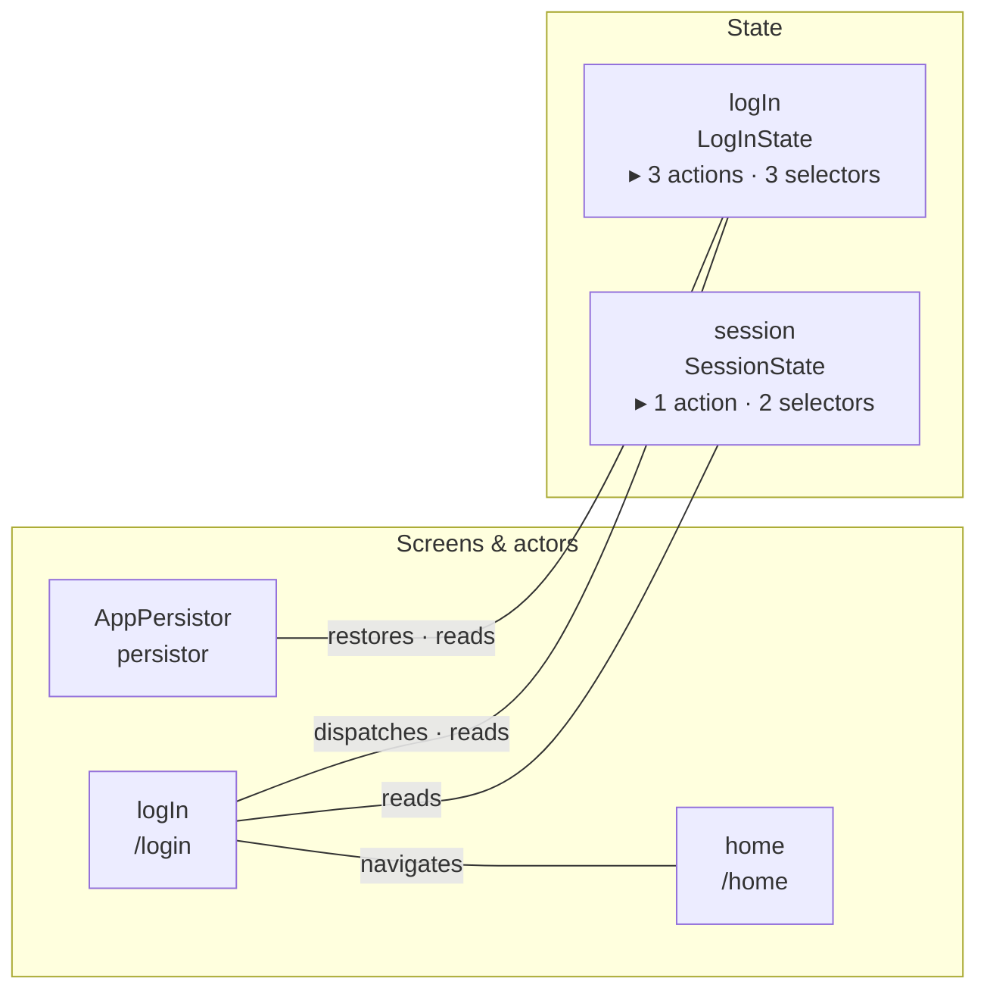
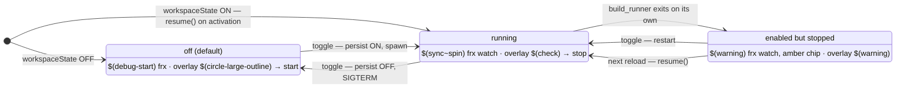
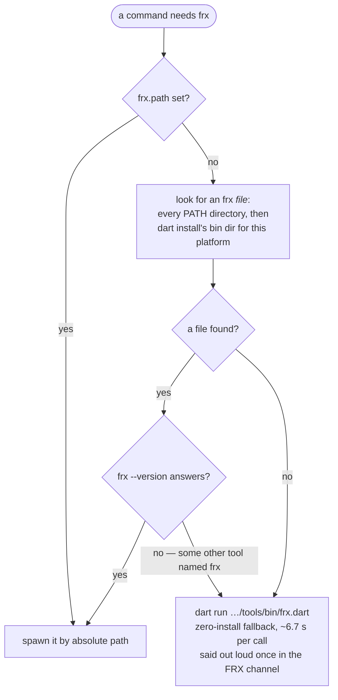

# FRX — VSCode extension

An editor wrapper around the [`frx`](../) scaffolding CLI:

- **Every capability by name in the Command Palette** — type `FRX:` and the whole
  inventory is there, searchable and bindable to a key.
- A status-bar **`frx`** item (monorepo only) that opens an **action overlay**:
  the same inventory, grouped, with the live `build_runner watch` state its icon
  also shows. One click, everything in one place.
- An **FRX tree view** in the Explorer: the app's substates and routes, read
  live from one `frx graph --json`. Click a leaf to open its source; inline
  actions add an action to a substate or remove a substate/page.
- **`frx doctor` findings in the Problems panel** — wiring drift, stale codegen
  and misplaced declarations show up as squiggles, refreshed after every
  scaffold/removal.
- **Right-click a Dart symbol → FRX: Rename…** renames that artifact, resolving
  what is under the cursor rather than asking which one you meant.

The CLI does the real work (file generation + AST wiring). This extension adds
the affordances a terminal can't: it resolves the CLI even when VSCode has no
shell PATH, prompts before overwriting, opens the new file, and runs (or, with
watch on, skips) `build_runner`.

---

## Features

### Add Substate

- **`FRX: Add Substate…`** — Command Palette or the action overlay.
- **Pick a kind** — a quick pick chooses the substate flavour:
  - `value` — a single nullable `value` field + `SetValueAction`.
  - `search` — a `query` string + `IList<int> view` + `SetQueryAction`.
  - `table` — a byId `IMap` table + `view` + `Add…` / `Retrieve…` actions.
- **AST wiring** — composed into `AppState` (import + factory field + `initial()`
  entry) by the CLI.

### Add Page

- **`FRX: Add Page…`** — Command Palette or the action overlay.
- **Pick access** — **Protected** (default) or **Public** (reachable while logged
  out → the route is added to the auth guard's `_authArea`, via `--public`).
- **AST wiring** — generates the page (`ui`) + `@RoutePage()` connector (`app`),
  inserts the connector import and an `AutoRoute(...)` entry into `AppRouter`.

### FRX tree view

The Explorer gains an **FRX** view (monorepo only) with two groups:

- **Substates** — every field composed into `AppState` (name + type), each
  expanding into **what belongs to it**: its actions and its selectors. Click
  any row to open its source. Inline on a substate: **Add action…** (pre-fills
  it) and **Remove**.
- **Routes** — every route registered in `AppRouter`, with its path and what
  makes it special. Click → opens the page connector. Inline: **Remove**.

```text
FRX
├─ Substates
│  ├─ logIn                   LogInState
│  │  ├─ ⚡ LogInWithEmailAction   async · WaitingAction · throws
│  │  ├─ ⚡ SetEmailAction
│  │  └─ ƒ  isWaiting
│  ├─ session                 SessionState
│  │  ├─ ⚡ SetTokenAction         nothing dispatches
│  │  └─ ƒ  token                  nothing reads it
│  └─ wait                    Wait
└─ Routes
   ├─ SplashRoute             /splash · initial
   ├─ LogInRoute              /login · public
   └─ HomeRoute               /home
```

An action row carries how it runs — `async`, its async_redux mixins, and
whether it can throw a `UserException`. A selector sheds its `Select…` prefix,
because the row above already says it. Clicking a selector lands **on the
getter**, not at the top of `selectors.dart` — every selector in the app shares
that one file, so the file alone answers "which file" and not "which one".

**`nothing dispatches`** and **`nothing reads it`** mark an action frx found no
dispatcher for and a selector it found no reader for. Both are warning icons
rather than Problems entries on purpose: the caller may be the code you are
about to write, and in a template a selector can be API offered to whoever
builds on it — so `doctor` stays quiet, and an ambient tree shows it without
claiming a defect. A selector read only by another selector nothing reads is
marked too (`read only by selectors nothing reads`); see
[the CLI's notes](../README.md#which-selectors-nothing-reads) for how that is
worked out and where it deliberately guesses "used".

A substate only offers an expand arrow when something is under it; async_redux's
own `wait` field owns nothing of ours and stays a leaf.

The view reads **`frx graph --json`** — one read where two `list-*` calls used
to go, carrying the same rows plus what each substate owns and the facts a flat
list drops. It refreshes after every add/remove, on external edits to the
redux / navigation / connectors sources (file-watcher, debounced), or via its
title-bar ↻; the graph is cached per refresh, so expanding rows costs nothing.

### Picking an existing substate / page

When a command needs an **existing** substate (Add action / field / selector)
or artifact (Rename / Remove) and you didn't launch it from the tree or a lens
(which pre-fill the target), FRX shows a **type-to-filter quick pick** of what
actually exists, read live from `frx list-substates` / `list-routes`. Start
typing to filter; it falls back to a free-text box if the list can't be read.

Rename / Remove take either kind, so their picker is **grouped**:

```text
── Substates ──
  logIn            LogInState
  session          SessionState
── Pages ──
  LogIn            /login
  Splash           /splash
```

Picking from a group also tells FRX *which* kind you meant, so it passes
`--kind` and never has to re-ask when a substate and a page share a name.

### Remove

**FRX: Remove…** (overlay, palette, or a tree item) is the inverse of the
scaffolders: it previews the removal plan — files to delete, wiring to undo
(`AppState` field, selectors, `AutoRoute` entry, auth-area membership) — in the
same [plan document](#rename-f2) rename uses, and only applies it (CLI
`remove --apply`) after you press ✓ Apply on that tab. Ambiguous names (both a
substate and a page exist) prompt for which
one. build_runner then finishes the job, honouring the watch state and the
`frx.runBuildRunner` setting.

### Rename (F2)

Press **F2** on a symbol that belongs to a substate or page — its state class
(`LogInState`), `Select…` selector, route (`HomeRoute`), connector
(`LogInPageConnector`), or the bare field/folder name — and FRX renames the
**whole artifact**: moves the files, rewrites the classes, and updates every
wiring reference (`AppState`, selectors, `AutoRoute`, imports) via `frx rename`.
Any other symbol falls through to the Dart extension's normal rename.

Which symbol maps to which artifact — and the canonical name handed to
`frx rename` — is resolved by the CLI (`frx which`), so the conventions aren't
re-encoded in the editor. **FRX: Rename…** (overlay, palette, tree item, or
editor context menu) does the same thing with prompts, and is the reliable path
if F2 is claimed by another extension. Turn F2 off with `frx.editorRename`.

Invoked with no artifact named — from the palette or the editor context menu — it
**tries the cursor first**, through the same resolver, and only shows the artifact
picker when the symbol is not one of ours (or no Dart editor is open).

**Nothing is renamed sight-unseen.** Every path — F2 included — first runs the
rename as a preview (frx writes nothing without `--apply`), and the plan opens as
a **markdown document in the built-in preview, beside your code**:

```markdown
# Rename "theme" → "appTheme"

**2 files moved · 1 file deleted · 8 files edited**

| | file |
| --- | --- |
| move | `business/lib/redux/theme/models/theme_state.dart` → `…/app_theme_state.dart` |
| delete | `business/lib/redux/theme/models/theme_state.freezed.dart` |
| edit | `business/lib/redux/app_state.dart` |
```

Every path is a **monospace cell you can click into the file it names** (a move
links its source — its destination does not exist yet), and each edit brings its
unified diff along in a fenced `diff` block. **Remove** shows the same document.

**The document answers itself.** Its own tab carries the two buttons — **✓ Apply**
and **✕ Discard** — so nothing is ever in front of the plan while you decide:

```text
┌ frx-plan-7.md ───────────────────────── ✓ Apply   ✕ Discard ┐
│ # Rename "theme" → "appTheme"                               │
│ **2 files moved · 1 file deleted · 8 files edited**          │
```

That replaces a modal, and the modal was not a cosmetic problem. VSCode's modals
are *application*-modal: it blocked the whole workbench, so the document it
pointed at ("the plan is open beside this dialog") could not be scrolled or
clicked until you had already answered. You saw what a rename would do only after
agreeing to it — the one thing a preview exists to prevent.

**A preview can carry buttons**; just not in its body. Its tab's toolbar is where
`frx.routes` and `frx.flow` had been living all along, and it is where ✓/✕ live
now, gated on a context key raised exactly while the plan's own tab is active.

Three things end the wait and nothing else does: ✓, ✕, and closing the tab (a No).
Moving to another tab deliberately does not — following a path out of the table is
the reading the plan is *for*. While an answer is outstanding a status-bar chip
says so, and clicking it **shows the plan** rather than applying it: there is no
route to applying that does not go past the plan.

**The extension ships no renderer for this.** The document is drawn by the
built-in markdown preview, the same platform renderer the
[Flow view](#flow--a-pages-use-cases-as-a-sequence-diagram) uses. It is opened
through `vscode.openWith` rather than `markdown.showPreview`, and that is
load-bearing: the preview-as-custom-editor gives the tab a **`uri`**, where
`markdown.showPreview` gives a webview tab carrying only a `viewType`. Only the
first can say *which document* a closed tab held — which is what makes "closing
the tab is a No" exact, and what stops the buttons appearing on an unrelated
markdown preview.

**Every plan gets its own document** — hence the number in the tab name, and
hence a tab and its file that are both retired the moment you answer. Plans used
to share one path, and that was wrong twice over: VSCode caches a text model by
URI and keeps it alive past the editor that used it, so writing a new plan to a
familiar path and reopening it rendered *the previous one* (ask for a removal
right after a rename, and the rename's plan is what appeared); and with one path,
a plan replacing another could not close "the plan tab" without closing the tab
its replacement had just opened. A fresh path has neither problem.

And the document is built from the CLI's
[machine plan](../README.md#machine-readable-output) (`rename --json`), not by
re-parsing the human report: rendering a table needs the plan as data.

Discarding leaves nothing written; closing the tab forgets it.

**What ran is checked against what you read.** Because the answer can now wait as
long as you like, the tree can move in between — and `--apply` recomputes from
disk rather than replaying the preview, so it always derives correct edits for the
tree as it stands, but not necessarily the ones you were shown. The apply runs
with `--json` too and the two changesets are compared; when they differ, the
notification says so (`the tree changed since the plan: 9 files edited, where the
plan showed 8 files edited`). Checked rather than prevented: the CLI's pre-flight
and atomic rollback already cover the cases that are actually dangerous, and what
was left — that what ran might not be what you read — is said out loud instead of
smoothed over.

The native refactor-preview panel was considered and set aside, and the reason is
worth recording: it would render paths as a real file tree with inline diffs, but
its per-change checkboxes are only honest if the **editor** applies the edits —
and application belongs to the CLI, together with formatting, the derived-docs
refresh and codegen. Splitting that to get a prettier preview is a larger decision
than a presentation change can make.

### Add action

**FRX: Add action…** (palette, overlay, the tree's inline ⚡, or the state-file
lens) scaffolds a `ReduxAction` into a substate. Four
prompts: the name, the
substate (skipped when the tree or the lens already named it), the body shape —

- `sync` — `AppState? reduce()`
- `async` — `Future<AppState?> reduce() async`
- `waiting` — `extends Action with WaitingAction`

— and then a **multi-select of async_redux behaviour mixins**, read live from
`frx list-mixins --json`. Press Enter with nothing ticked to skip them.

**Conflicts resolve as you pick.** async_redux makes some pairs a compile error
(they collide on a private member), so a combination the CLI would refuse must
not survive the picker: ticking `debounce` unticks `retry`, and the placeholder
says which went and why. It is judged over the whole selection, newest first —
a rule phrased over what *changed* misses a conflicting pair that arrives in
one event, since both are then new.

The rows themselves never change. Removing the conflicting ones was the obvious
design and it does not work — assigning `items` clears the selection and reports
that a tick later, so the pick that triggered the rebuild is wiped a moment
after you make it. Unticking touches only the selection, and it reads better
anyway: you see what happened instead of watching a row disappear.

The exclusion is the CLI's, not the editor's: `conflictsWith` arrives with the
implications already folded in, so `noDialog` excludes `abortWhenNoInternet`
through the `checkInternet` it implies. The editor does set membership and
nothing else — it used to carry its own list of mixins, and that copy had
drifted to eight of the ten.

The CLI still resolves the rest: it pulls in a mixin's dependencies (`noDialog`
implies `checkInternet`, shown in the row) and emits the tuning overrides worth
surfacing — a `debounce` or `throttle` arrives with its duration already in the
class.

### Add tabs

**FRX: Add tabs…** scaffolds an `AutoTabsScaffold` shell with its tab pages: enter
the flow's name, then the tab names as a comma-separated list (at least two —
one tab is not a tab flow). Each name is validated the same way an artifact
name is.

The CLI writes a page + connector per tab plus the shell connector, and wires
one nested `AutoRoute(page: <Shell>.page, children: [...])` into `AppRouter`.
The first tab page opens afterwards, since that is the one you flesh out first.

### Add field

**FRX: Add field…** (overlay, palette, or the state-file lens) grows an existing
substate's `@freezed` state: enter `name:type` (e.g. `email:String?`,
`count:int`, `tags:IList<String>`), a `@Default(…)` for a non-nullable type, and
optionally a `Set<Field>Action` setter. The field is spliced into the factory
via AST and freezed regenerates (honouring the watch / `frx.runBuildRunner`).

### The right-click gesture

**FRX has no folder entries.** It had three — Add Substate… on a `redux/` folder,
Add Page… on `pages/`/`connectors/`, and a "New here…" menu on any folder — and
they are gone. The clicked folder was only ever used to compute the repo root,
and the first workspace folder yields the same answer, so in a single-root
workspace (which is how this monorepo is opened) those entries carried no
information at all. The only case where the click decided anything was a
multi-root workspace holding two frx monorepos, and that is not worth two menu
entries and two visibility conditions.

Two things went with them: the manifest no longer names the `redux`, `pages` or
`connectors` folders in a visibility condition, and the extension no longer keeps
its own copy of the non-substate folder list — that copy existed only because
"New here" had a clicked folder and no resolved workspace, so it could not consult
the CLI live.

**What right-click does carry is the Dart editor entry.** On a symbol in a `.dart`
file, **FRX: Rename…** resolves the artifact under the cursor through the same
identifier resolver F2 uses, and renames it without asking which one. On a symbol
frx does not own it falls back to the artifact picker: it cannot chain to the Dart
extension's rename — a menu item is a command, not a link in a chain — and hiding
it conditionally would need a CLI call on every cursor movement, since visibility
conditions are evaluated synchronously.

### Widget: archetype, then folder

**FRX: Add Widget…** asks three things: the name, the archetype, and the folder.

The archetype (`view`, `field`, `choice`, `action`, `container`) decides what
the widget takes in, which primitive it wraps, and which states its previews
enumerate — so it is asked before the folder, whose suggestion depends on it.

The folder picker is a live `QuickPick` over `frx list-widget-dirs --json`: the
folders already in use, the archetype's usual home first and labelled as such.
Type a name that matches none of them and it appears as its own row —
`cards  ⊕ new folder`. `--dir` is deliberately open, and `showQuickPick` can
only ever return one of its items, which is why this one is driven directly.

The list comes from the CLI rather than from a directory scan here, so the
shell completion and this picker cannot disagree about what exists.

### Add selector

**FRX: Add selector…** (overlay or palette) adds a computed getter to a
substate's `Select<Pascal>` block in the selectors facade — enter the getter
name and return type; the body defaults to reading the state field of the same
name (customize with `--expr` on the CLI). No codegen — selectors are
hand-written.

### Wire navigation

**FRX: Wire navigation…** (overlay or palette) makes one page push another:
pick the source and destination from the registered routes, pick which
`GoAction` (`push` / `replace` / `navigate`), and frx writes the `_Vm` field,
the dispatch that fills it, the argument handed to the page, and the page's own
parameter — five edits across two packages, four of which leave code that does
not compile if you stop halfway.

Both sides are picked rather than typed because `add-nav` refuses an
unregistered destination: auto_route generates no route class to push. It is
idempotent — wiring the same hop twice reports that the callback is already
there and stops.

### Flow — a page's use cases as a sequence diagram

**FRX: Flow…** (overlay, palette, or the **Flow** lens on a page connector)
renders what actually happens when the user interacts with a page: every
view-model callback, what it dispatches and how (`dispatchSync` vs an awaited
`dispatchAndWait`, drawn with activation bars), each action's mixins and the
`copyWith` field it writes, a `UserException` it can throw, guarded steps as
`alt` blocks, and where the flow navigates.

The diagram comes from `frx flow <page>`, which reads it out of the source AST —
so it always describes the code as written rather than a stale drawing.

**Rendering is VSCode's own.** Since 1.121 the built-in
`mermaid-markdown-features` draws mermaid in the markdown preview, so the view
writes a markdown document and opens it there rather than shipping its own
renderer. The extension vendors nothing, and pan/zoom, **copy source** and
**open in editor** come from the platform. The two view-switching buttons —
**Navigation map** and **Flow…** — sit in the preview's own toolbar
(`when: activeWebviewPanelId == 'markdown.preview'`), and the same commands stay
in the palette, the FRX overlay, the tree's title bar, and the **Flow** lens
above a page connector.

This is why `engines.vscode` is `^1.121.0` — the release that merged Matt
Bierner's *Markdown Preview Mermaid Support* into VSCode as a built-in. On an
older VSCode the preview would show the diagram as a plain code block.

### Navigation map — the whole app in one graph

**FRX: Navigation map** (overlay, palette, or the tree's title bar) shares that
panel and zooms out: every route the router registers — nested tab children
included — and every hop between them, from `frx flow --routes`.

Hops are collected from the `GoAction` dispatches in each connector *and* in the
reducers those connectors reach, so a navigation buried in an action shows up
(marked `⚡`) — that's the edge a hand-drawn map always misses. A solid arrow is
a `push`, thick replaces the stack, dashed is a `pop` drawn back to the screen
that pushed it. The stadium node is `initial: true`, the subgraph is the guard's
`_authArea`, and a dashed border means nothing pushes that screen — you arrive
by path, deep link or a guard redirect.

Run `frx flow --md` once to export all of it to `docs/flows/`; from then on
`frx doctor` (and so this extension's Problems panel) fails when the docs fall
behind the code, with a **regenerate docs/flows** quick-fix on the finding.
Those exported files are ordinary markdown, so previewing them renders the same
diagrams — and the links between them work.

### Map — the structural picture

**FRX: Map** (overlay, palette, or the tree's title bar) opens a webview whose
purpose is **orientation**: arriving in unfamiliar code and seeing how the app is
put together. It is drawn from **one** `frx graph --json` read.



The shape, not the rendering: the webview draws its own SVG — this diagram stands
in for it here, and the properties below are what that renderer adds. The panel
also carries what the graph could not resolve:

```text
⚠ 1 unresolved edge(s)
  dispatch-target  SomeFactory()
      dispatched, but no imported `*_action.dart` declares it
```

**Two rows are joined by one line, however many relations run between them.** A
page that both dispatches into a substate and reads it is two relations with the
same two endpoints; drawn separately they lie exactly on top of each other —
indistinguishable anywhere, and doubling every crossing they take part in.
Direction folds in too: the picture draws no arrowheads, so two pages that
navigate to each other are one stroke. Hovering the line names every relation it
carries, and the ones running the other way are marked.

**Two relations never leave a row from the same point.** Each is given a slot
along the row's edge, ordered by the row it reaches so a row's fan does not cross
itself, and relations across the middle are drawn as curves rather than chords —
two that leave a few pixels apart and land far apart then stay apart the whole
way instead of converging into one stroke at each end.

**A relation inside a column runs in the margin, not across the picture.** A page
navigating to another page, or a substate read by another substate, joins two rows
on the *same* side. Drawn straight it would leave one row's right edge and enter
its neighbour's left edge, looping across the whole canvas and crossing everything
between; instead it arcs out into that column's own margin and back, bulging wider
the further it reaches — up to the width of the margin, past which the arcs share
it. Those
relations also get a say in the order, so a page that only navigates sits beside
the page it navigates to instead of sinking to the bottom.

**The rows are ordered by their edges, not by name.** The number of crossings in a
two-column drawing is decided entirely by the order of the two columns, so the
columns are arranged to reduce it — each row placed near the mean position of the
rows it connects to, swept back and forth until it settles, from a number of
starting orders. Alphabetical order has nothing to do with the edges: on this
repository it left **44** crossings where **2** was available, over the same
nineteen rows and twenty lines. The arrangement is a function of the graph
alone, so re-opening the picture or refreshing it after an unrelated edit does not
rearrange it. A row nothing connects to has no place to be near, so it sinks to
the bottom of its column rather than splitting the connected ones apart.

**Legibility comes from a skeleton, not from filtering.** Substates and pages are
always visible and form the shape of "how it is built"; **actions and selectors
collapse into counts on their owner** and expand on demand. The count of substates
and pages grows slowly as an app grows while the count of actions and selectors
grows fast, and that asymmetry is what keeps the view readable at ten times this
template's size — where an overview matters most and drawing everything degenerates
into a hairball. Four dispatches from one page into one substate are **one** line.

**Hovering a row dims everything it is not attached to.** The cheapest large win
in legibility, and the one that changes nothing about what the picture contains:
the crossings that remain stop mattering when a reader can isolate one row's
relations instead of following a line through the ones that cross it. Attached
means *directly* — the rows this one relates to and the wires between them; the
transitive reach is what `frx graph --focus X -d inbound` is for.

**Every node opens its source** — a substate its state file, a page its connector,
a selector the exact getter (every selector in the app shares one file, so the
file alone answers "which file" and not "which one"). **↻ Refresh** re-reads.

**Unresolved edges are shown.** A diagram reads as exhaustive, so it owes the
reader a statement of where its own edges are incomplete — the argument the CLI
already makes for naming unresolved edges, applying harder to a picture than to a
list.

#### The rule: which surface does a feature belong to?

> **The tree is an actionable inventory of what exists.**
> **The picture is the relationships between what exists.**

Apply it to a proposed feature by asking which of the two it is *about*. Hygiene
marks — `nothing dispatches`, `nothing reads it` — describe an **absence of
relationships**, so they belong to the tree and are deliberately absent here.
Unresolved edges describe the picture's own edges, so they are here.

Each surface keeps what the other cannot have. A tree cannot state "these three
pages dispatch the same action" without repeating the row and destroying the fact.
The picture cannot have inline actions on its items, or ambient presence in the
sidebar.

### Code lenses

On the monorepo's conventional files (always on — see [Settings](#settings)):

- `redux/<sub>/models/<sub>_state.dart` — **⚡ Add action…** and **➕ Add
  field…** above the state class, pre-filled with that substate.
- `app/lib/connectors/<x>_page_connector.dart` — **Open page** jump (shown only
  when the counterpart file exists) and **Flow**, which opens that page's
  sequence diagram.
- `ui/lib/pages/<x>_page.dart` — **Open connector** jump (same condition).

Lenses are derived from paths and a class-name regex — no CLI call, so they
render instantly.

### Doctor → Problems panel

`frx doctor` findings are mirrored into the **Problems panel** (via
`doctor --json`): errors and warnings appear as squiggles on the file they
anchor to, refreshed on activation, after every scaffold / removal /
build_runner run, and on external edits to the wiring sources (same
file-watcher as the tree). A second status-bar chip next to the watch toggle
shows the ambient health — `$(pass) doctor` when clean, `⚠ N` / red `✗ N`
otherwise — and clicking it opens the Problems panel. The overlay's **Doctor**
entry still streams the full report to the FRX output channel.

Auto-fixable findings (a missing generated part, an orphan substate) get a
**quick-fix lightbulb** — "generate missing code" / "remove orphan substate" —
that runs `frx doctor --fix` and re-audits. Report-only findings (a route
without a connector, say) carry no fix.

**One fixable finding has no lightbulb, and cannot.** An
[empty artifact folder](../README.md#the-folder-a-substate-leaves-behind) is
fixable but anchors on no file — the Problems panel squiggles files, not
directories — so the chip counts it and Problems cannot show it. It is named in
the overlay's **Doctor** report (the FRX output channel) and cleared by **Doctor
— fix**. The asymmetry is the finding's, not the panel's.

### One inventory, two renderings

**Every capability has a command identity**, so it is findable by name in the
Command Palette, bindable to a key, and invocable from a task. The **action
overlay** carries the same inventory, grouped under the CLI's own families
(Create & wire, Edit existing, Inspect, Workflow) with each row's one-line
description — and the live watch state, which is the one thing a searchable
palette cannot show.

That is a rule, not an arrangement: **a capability appears in both indexes**, so
a new one needs no placement decision. It is worth stating because the previous
arrangement rotted quietly in both directions — three commands had no palette
entry at all (which in this editor means *visible in every workspace*, not
hidden), the action scaffolder was explicitly hidden, eight capabilities had no
command identity whatsoever, and the report-only audit was reachable only from
the overlay while the destructive **Doctor — fix** was the searchable one.

**Every command is gated on `frx.isMonorepo`.** There are no submenus: the seven
single-file scaffolders that used to hide behind a **New…** row (widget,
connector, model, enum, service, Retrofit client, theme extension) each have their
own entry now. Declaring them made existing capability discoverable; it added
none — the surface count rose, the concept count did not.

**One stated exception, for a stated reason.** The rule's subject is capabilities
of the tooling — things that change the code or reveal something about it — and a
control that acts on the tooling's *own UI* is not one. So the tree's **Refresh**
stays on the tree's title bar and out of both indexes, the way a scrollbar would;
and **FRX: Actions…**, which *is* the overlay, is in the palette but not a row
inside itself. Both are pinned by `extension_contract_test.dart`, which fails if
any other declared command is missing from either index.

**A command id is checked in both directions.** The contract test and
`validate-manifest.ts` between them ask: is every *declared* command registered,
surfaced in the palette and in the overlay, and named only by menus that exist —
and is every id the *source invokes* declared. That last one was missing, and its
absence cost a renamed command: a code lens is reached by neither the manifest nor
the registration, so it kept firing an id that was gone, and only a click found
out.

### Action overlay & watch toggle

In our monorepo the status bar shows an **`frx`** item. Its icon reflects the
`dart run build_runner watch --workspace` state; clicking it — or pressing
**`Ctrl+Alt+F`** — opens the action overlay:

Three states, and which one you are in is `enabled` (persisted) × `running`
(a live child process) rather than one flag:



`enabled but stopped` is the state nothing *asks* for: the toggle never lands
there, only a watch dying under it does — which is why it gets an amber chip
instead of the plain icon, and why one click out of it **restarts** rather than
switching off. **The toggle branches on the process, not on the persisted
flag** — those two agree everywhere except here, and branching on the flag made
that click persist OFF, so the click the crash notification, the chip and the
overlay row all call "restart" needed a second one behind it.

- **Persisted per-workspace** — a watch left ON auto-resumes on the next VSCode
  reload (stored in `workspaceState`, not a shared setting).
- **Skips the build_runner prompt** — while the watch is running, Add Substate /
  Add Page don't offer to run `build_runner`; the watch regenerates on save.
- Watch logs stream to the **FRX watch** output channel (`FRX: Show watch
  output`, also in the overlay once the watch has run).
- **Builder failures land in the Problems panel** — the watch output is parsed
  (`E <builder> on <file>:` blocks with their `package:` locations) and each
  failure becomes a squiggle at the exact line/column; a following clean build
  cycle clears them, and so does stopping the watch.

### Shared

- **Name in any casing** — `myProfile`, `my_profile`, `MyProfile` all work
  (matches the CLI's `Casing.parse`, which also rejects illegal characters).
- **Overwrite guard** — a modal prompt instead of a silent clobber (re-runs with
  `--force` only on confirmation).
- **No plan before creating.** Destructive operations always show one, creative
  ones never do — see [Risk grading](#risk-grading).
- **Opens the new file** so you can start editing immediately. Always: if you
  scaffolded it, you are about to edit it.
- **build_runner integration** — generate the freezed part / auto_route class
  right after (`frx.runBuildRunner`), unless the watch is already running.
- **Output channel** — CLI output streams to the **FRX** channel; it pops open
  automatically on failure.

## How it runs the CLI

The extension never assumes `frx` is on PATH, and — this is the part that used to
be wrong — it never asks the operating system to find it either. It resolves the
invocation in order:



1. **`frx.path` setting** — an explicit path to the executable, if you set one.
2. **An installed binary**, found as a *file*: each directory on `PATH` first, so
   a deliberately arranged `PATH` still decides which binary wins, then the
   directory `dart install` writes to for this platform —
   `~/.local/state/Dart/install/bin` on Linux,
   `~/Library/Application Support/Dart/install/bin` on macOS,
   `%LOCALAPPDATA%\Dart\install\bin` on Windows. It is then run **by absolute
   path**, and confirmed with `frx --version` (which also rejects an unrelated
   tool that happens to be named `frx`).
3. **`dart run …/tools/bin/frx.dart`** — zero-install fallback. The extension
   finds the monorepo's `tools/` package (from the workspace or from its own
   location) and runs the CLI from source. Works straight from a fresh clone,
   provided the Dart SDK is on PATH and `tools/` has had `dart pub get`.

**Why step 2 searches rather than spawns.** A GUI-launched editor does not have
your shell's `PATH`: on Linux the desktop session's environment comes from
systemd, which never reads a shell rc file, and a Dock-launched VSCode on macOS
has the same hole — so the directory `dart install` told you to add is often
simply absent. Spawning the bare name `frx` and letting the child inherit that
`PATH` made "is the CLI found" depend on whether the editor happened to be
started from a terminal. Looking for the file, and spawning its absolute path,
does not.

Because of the fallback, **installing the CLI is optional** — but it is not free.
`dart run` re-compiles the CLI, `analyzer` and all, on *every* invocation, and the
extension invokes frx on every file event, tree expansion and doctor pass:

| | `--version` | `graph --json` | `doctor --json` |
| --- | --- | --- | --- |
| installed binary | 6 ms | 22 ms | 17 ms |
| `dart run` | 6.7 s | 6.7 s | 6.7 s |

So landing on the fallback is said out loud, once, in the **FRX** output channel.
The channel also names the binary that was chosen — the first line of every run
tells you which of the three you are on:

```text
$ /home/you/.local/state/Dart/install/bin/frx graph --json --root /repo   (cwd: /repo)
```

```bash
cd tools
dart install .      # the fast path; the extension finds it with no PATH edit
```

## Project detection

Everything is gated on real project markers — nothing is guessed:

| Layer | Mechanism | Purpose |
| --- | --- | --- |
| Editor entry | `when: frx.isMonorepo && editorLangId == dart` | **FRX: Rename…** on the context menu of a Dart file only |
| Status bar / watch / tree / Problems | `pubspec.yaml` with `workspace:` in a workspace folder | the `frx` toggle, FRX tree view, and doctor diagnostics appear **only** in the monorepo (`frx.isMonorepo`) |
| Authoritative check | frx `AppStateSource.locate()` / `RoutesSource.locate()` | walks up to `app_state.dart` / `app_router.dart` — the single sources of truth |

No condition names a folder any more — see [The right-click
gesture](#the-right-click-gesture) for why the entries that did are gone.

## Settings

| Setting | Default | Description |
| --- | --- | --- |
| `frx.path` | `""` | Explicit path to the `frx` executable. Empty → auto-resolve (see above). |
| `frx.runBuildRunner` | `ask` | `always` \| `ask` \| `never` — generate code after scaffolding. Ignored while the watch toggle is running. |
| `frx.editorRename` | `true` | Let **F2** on a substate/page symbol rename the whole artifact via `frx rename`. Off → always use the Dart rename. |

**Three, and each describes a real difference.** `frx.path` is the only way to
intervene when CLI resolution guesses wrong. `frx.runBuildRunner` has three values
and its wrong value costs time on every generation. `frx.editorRename` is the only
one whose two branches are caused from *outside* this repository — F2 may be
claimed by another extension on one machine and not another.

**Three more were removed**, because they described forks nobody takes. Their
behaviour is frozen at the value people already used:

| Removed | Now |
| --- | --- |
| `frx.openAfterCreate` | The created file **always** opens. If you scaffolded it, you are about to edit it. |
| `frx.confirmPlan` | **No plan is shown before creating** — see [Risk grading](#risk-grading). |
| `frx.codeLens` | Lenses **always** render. |

The lens setting is the one that took a real capability with it, and that is worth
naming rather than glossing: the editor's own global lens setting already hides
*every* provider's lenses, so ours added only the granularity of killing frx's
while keeping Dart's. It is dropped because nobody asked for it.

### Risk grading

> **Destructive operations always show a plan. Creative ones never do.**

Creation is the most frequent operation, and a step added there is paid every
time — while the thing a plan guards against is undone by one `frx remove`.
Rename and removal continue to show theirs **unconditionally**, as they always
have: they move and delete files across packages, and that is not undone by one
command.

The watch on/off choice is **not** a setting either — it lives in per-workspace
state and is driven by the status-bar toggle.

---

## Develop

TypeScript, compiled to CommonJS in `out/` — VSCode loads `out/extension.js`.

```bash
npm install
npm run compile     # or: npm run watch
npm test            # compiles first, then node --test over out/test
npm run typecheck   # tsc --noEmit, the CI gate
```

Open `tools/vscode/` in VSCode and press **F5** (run `npm run watch` alongside
so edits recompile). A second "Extension Development Host" window launches with
the extension loaded; open the monorepo there, right-click a symbol in a `.dart`
file, and check the `frx` item in the status bar.

`tsconfig.json` runs under full `strict`. One setting is load-bearing and worth
knowing before you touch it: the tests swap in a mutable `vscode` stub through
the module loader and reach into it by identity, which survives TypeScript's
`__importStar` wrapper only because that wrapper installs live getters. For the
same reason a test that replaces an export (`frx.run = …`) must import the
module with `import x = require('…')` — a plain `import * as` would hand it a
wrapper, and the stub would never reach the module under test.

`extension.ts` is pure wiring (activate + command registration); everything
else lives under `src/`, split into layers:

```text
tools/vscode/
├── extension.ts            # activation + wiring: services + command registration
├── src/
│   ├── app.ts              # the `App` context every command handler receives
│   ├── frx.ts              # resolve & run the CLI (Invocation/RunResult), output channel
│   ├── queries.ts          # typed --json reads (graph/list-*/doctor/which/flow) + plan parse
│   ├── paths.ts            # workspace-root / package-root finding
│   ├── discover.ts         # finding the installed CLI (pure: PATH + dart install)
│   ├── layout.ts           # ordering the picture's columns to reduce crossings (pure)
│   ├── naming.ts           # casing (camel / pascal / strip*) — pure
│   ├── config.ts           # typed accessors for the frx.* settings
│   ├── ui.ts               # prompts, confirms, pickSubstate/pickArtifact, fail
│   ├── diagnostics.ts      # publishByFile (findings → DiagnosticCollection)
│   ├── scaffold.ts         # the create-and-wire engine (runScaffold + build_runner)
│   ├── doctor.ts           # doctor audit service (Problems + status chip) + run/fix
│   ├── watch.ts            # build_runner watch process + status-bar toggle
│   ├── buildlog.ts         # pure parser: watch output → Problems findings
│   ├── tree.ts             # FRX tree view (FrxTreeItem)  codelens.ts  # code lenses
│   ├── cursor.ts           # what artifact the cursor is on (F2 + the editor entry)
│   ├── rename_provider.ts  # F2 → frx rename        code_actions.ts # doctor quick-fixes
│   ├── map.ts              # FRX Map: the graph folded into a structural picture
│   ├── flow_view.ts        # FRX Flow: diagram → markdown → the built-in preview
│   ├── plan_view.ts        # a rename/removal plan → markdown → the same preview
│   └── commands/           # command handlers on the shared `app` context
│       ├── create.ts       # substate / page / action / field / selector / tabs
│       ├── artifact.ts     # rename / remove
│       └── menu.ts         # the FRX action overlay
├── test/                   # node --test suite (see below)
├── out/                    # compiled output — what the VSIX ships (gitignored)
├── validate-manifest.ts    # CI gate: declared ↔ registered ↔ invoked ↔ menus
├── tsconfig.json
├── package.json
└── README.md
```

**Tests** — `npm test` compiles, then runs a `node --test` suite over `out/test`
(a small `vscode` stub in `test/helpers.ts` lets the modules load under plain
node). It covers the pure logic (`naming`, the `queries` --json/plan parsing, the
`buildlog` parser, `discover`'s CLI resolution, `layout`'s column ordering), the
renderers that turn a CLI read into a document or a picture (`plan_view`,
`flow_view`, `map`), the watch toggle's state machine (through a `spawn` seam,
so no `build_runner` runs), the tree and code-lens item building, `cursor`'s
symbol→artifact mapping, the doctor quick-fixes, the overlay's rows, the
`pickSubstate`/`pickArtifact`/`--dir` pickers, and a load-smoke over every module
(catches a broken require path or circular-load break). `npm run validate` runs
the manifest gate; the palette ↔ overlay contract is pinned on the CLI side by
`tools/test/extension_contract_test.dart`.

## Build & install a VSIX

Packaging uses [`@vscode/vsce`](https://github.com/microsoft/vscode-vsce)
(listed as a devDependency).

```bash
cd tools/vscode

# Option A — with npx, no install:
npx @vscode/vsce package                 # → frx-<version>.vsix

# Option B — via the package scripts:
npm install                              # pulls in @vscode/vsce
npm run package                          # → frx-<version>.vsix

# Install the built VSIX into VSCode:
code --install-extension frx-0.1.6.vsix
# …or: npm run install:vsix
```

You can also install a `.vsix` from the UI: **Extensions** view → `…` menu →
**Install from VSIX…**.

To bump the packaged version, edit `version` in `package.json` (the VSIX
filename tracks it) and update the `install:vsix` script accordingly.

> Publishing to the Marketplace additionally needs a real `publisher` id and an
> access token (`vsce publish`). For local/team use, distributing the `.vsix`
> file is enough — no Marketplace account required.
